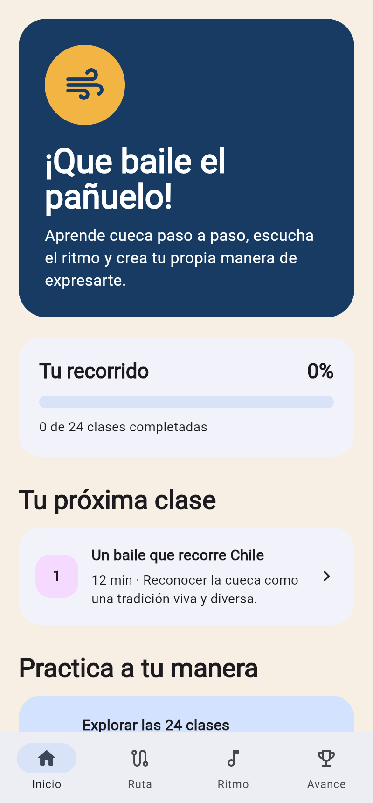
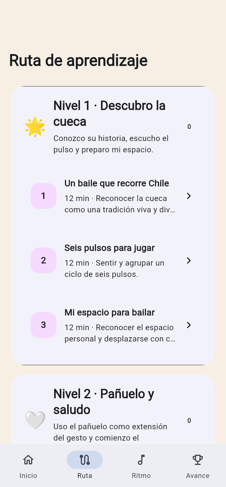
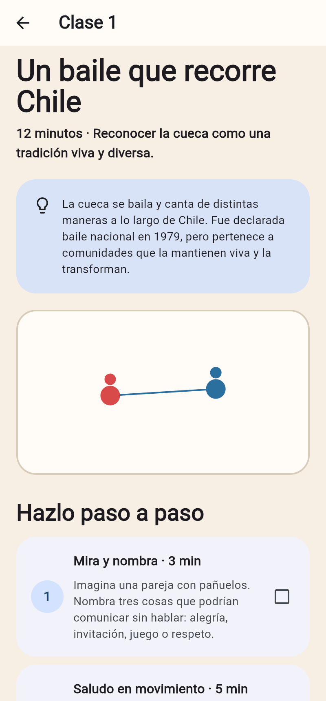
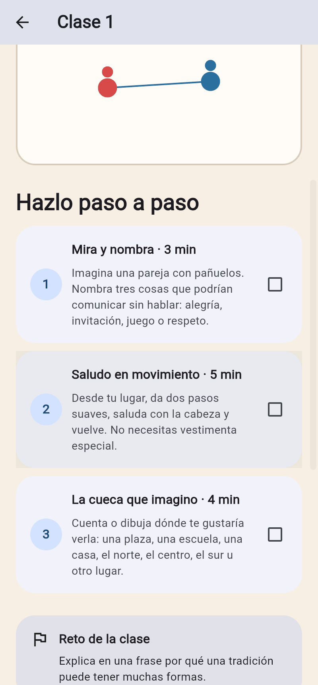
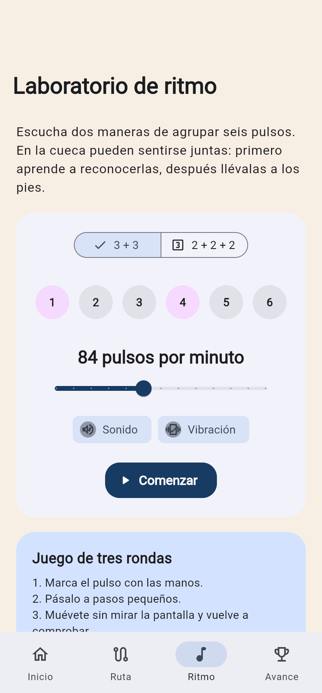
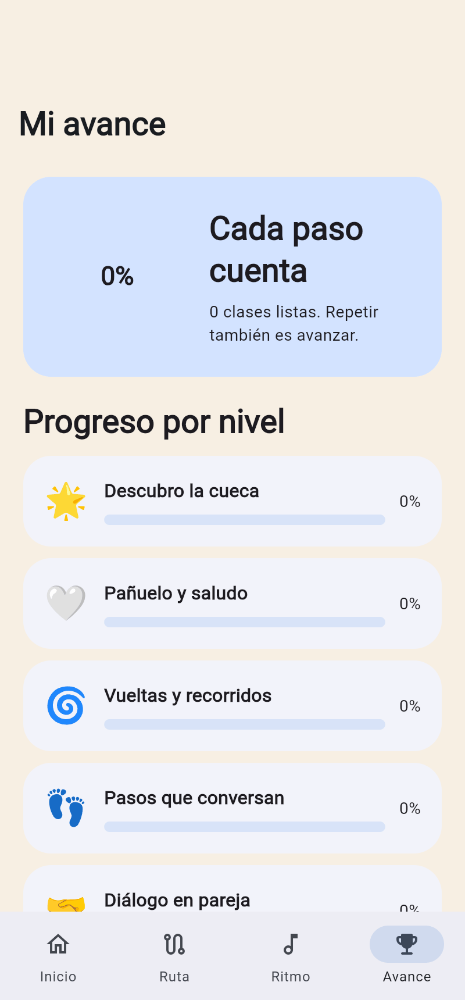
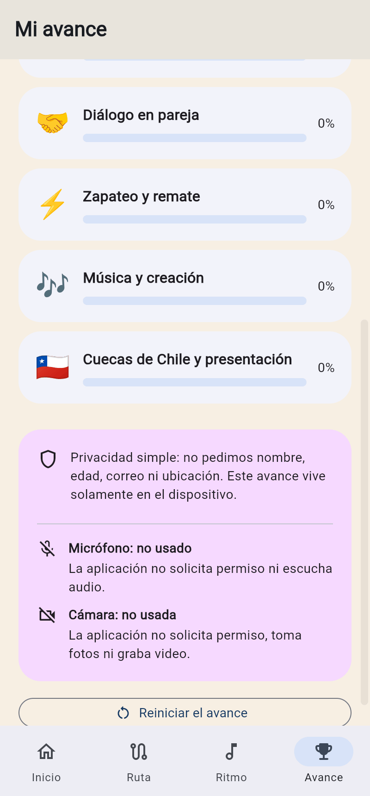
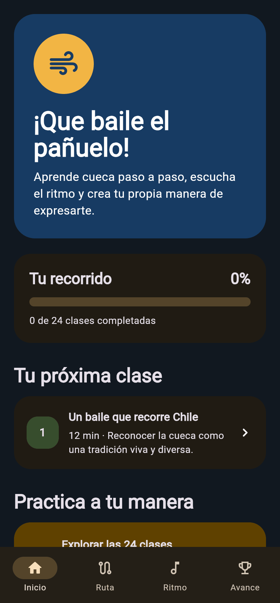
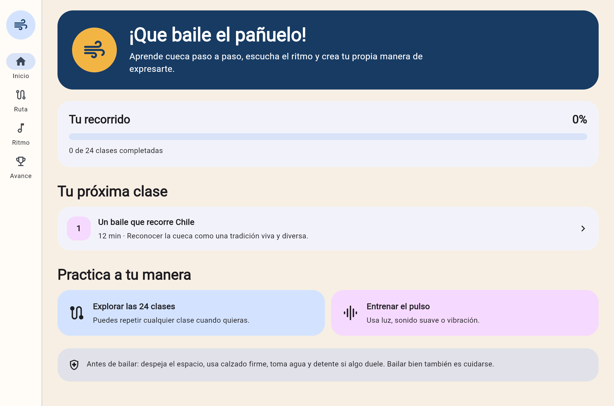
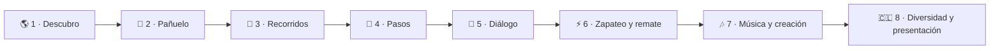

<div align="center">

# 🧣 Pañuelo al Viento

## **24 clases · 8 niveles · pulso, movimiento y cultura de la cueca**

**Aplicación educativa, privada y sin publicidad para acercarse a la cueca desde los 10 años. Una sola base Flutter para Android y Windows, preparada para aprender sin cuenta y sin conexión.**

[](https://github.com/vladimiracunadev-create/panuelo-al-viento-cueca-app/actions/workflows/ci.yml)
[](https://github.com/vladimiracunadev-create/panuelo-al-viento-cueca-app/actions/workflows/release.yml)
[](https://vladimiracunadev-create.github.io/panuelo-al-viento-cueca-app/)

[](CHANGELOG.md)
[](docs/CURRICULUM.md)
[](docs/CURRICULUM.md)
[](#-verificar)
[](docs/PERMISSIONS.md)
[](LICENSE)

[⬇️ Descargar](https://github.com/vladimiracunadev-create/panuelo-al-viento-cueca-app/releases/latest) ·
[🌐 Landing](https://vladimiracunadev-create.github.io/panuelo-al-viento-cueca-app/) ·
[👨‍👩‍👧 Guía para familias](docs/PARENT_GUIDE.md) ·
[🎓 Currículo](docs/CURRICULUM.md) ·
[🏗️ Arquitectura](docs/ARCHITECTURE.md) ·
[🔒 Privacidad](docs/PRIVACY.md) ·
[🗺️ Roadmap](ROADMAP.md)


</div>

---

> [!IMPORTANT]
> La aplicación **complementa, pero no reemplaza**, la guía de docentes y personas cultoras. La cueca es una tradición viva con expresiones territoriales diversas; esta versión enseña una ruta introductoria adaptable y no declara una coreografía única.

## 📸 Vistazo

|  |  |  |
| :---: | :---: | :---: |
|  |  |  |
| **Inicio** | **Ruta de 24 clases** | **Clase con diagrama de piso** |
|  |  |  |
| **Tres actividades con tiempo** | **Laboratorio de ritmo** | **Avance por nivel** |
|  |  |  |
| **Cámara y micrófono, a la vista** | **Modo oscuro** | **Escritorio con barra lateral** |

Las capturas se regeneran desde la aplicación real con `node tool/capture_screenshots.mjs`: no son maquetas.

## ✅ Estado verificable

| Superficie | Evidencia en `0.1.0` |
|---|---|
| 🎓 **Currículo** | **24 clases**, 8 niveles y 72 actividades; numeración, duración, campos y unicidad validados automáticamente. |
| 🥁 **Pulso** | Ciclo visual de seis pulsos, agrupaciones **3+3** y **2+2+2**, 60–120 PPM. Cada pulso se agenda contra un `Stopwatch` monotónico en un instante absoluto, así que un retraso puntual no desplaza los siguientes. |
| 🗺️ **Movimiento** | Diagramas accesibles para vuelta, ocho, medialuna, pasos, diálogo y pañuelo; equivalencia funcional en cada clase. |
| 💾 **Progreso** | Guardado local transaccional, próxima clase, porcentaje total y por nivel, repetición y borrado confirmado. |
| 🧪 **Calidad** | **25 pruebas** de modelos, currículo, persistencia, transacciones, navegación y contraste de color, más **2 validadores** que corren sin instalar Flutter. Formato, análisis estático y pruebas se ejecutan en CI sobre Flutter **3.44.6** fijado. |
| 🎨 **Contraste** | Cada par de color que la interfaz dibuja de verdad se mide contra **4,5:1 (WCAG AA)** en modo claro y oscuro; la prueba falla si una tarjeta deja de leerse. |
| 📦 **Distribución** | APK Android; Windows en `.exe`, `.msi` y `.zip` portable; `SHA256SUMS.txt` en cada release. Los cuatro nombres de archivo llevan la versión y el workflow rechaza la publicación si alguno no coincide. |
| 🔎 **Versión operativa** | La versión sale solo de `pubspec.yaml`. Antes de publicar, el workflow comprueba que el tag sea `v<versión>`, que existan sus notas y que el **APK compilado** declare esa misma versión. |
| 🔒 **Privacidad** | Sin servidor, cuentas, publicidad ni analítica. El APK publicado **no declara ningún permiso del sistema**: ni cámara, ni micrófono, ni siquiera internet. |

### Lo que contiene el APK publicado

`node tool/verify_apk.mjs` abre el archivo y mide lo que hay dentro. Sobre `PanueloAlViento-0.1.0-Android.apk`:

```text
· paquete cl.panueloalviento.panuelo_al_viento
· versionName 0.1.0
· versionCode 1
· minSdkVersion 24
· sin permisos del sistema declarados
· ABIs arm64-v8a, armeabi-v7a, x86_64
· currículo empaquetado 43165 bytes
· 8 niveles y 24 clases dentro del APK
· el currículo del APK coincide con el del repositorio
```

Un binario que compila y se firma todavía puede publicarse con la versión equivocada o instalarse sin contenido. Por eso la comprobación no confía en que la compilación salió verde: abre el paquete y cuenta lo que trae.

## ✨ Características funcionales

- **Ruta de ocho semanas:** contexto cultural, pulso, espacio, pañuelo, recorridos, pasos, diálogo, zapateo de bajo impacto, creación y presentación.
- **24 clases breves:** cada clase dura de 10 a 15 minutos y conserva la secuencia mostrar o descubrir → practicar → interpretar o reflexionar.
- **72 actividades originales:** tres por clase, con tiempo visible, casillas de avance y cierre celebratorio privado.
- **Diagramas de piso:** seis patrones dibujados en Flutter y descritos semánticamente para tecnologías de apoyo.
- **Laboratorio de ritmo:** compara dos agrupaciones de seis pulsos, permite regular velocidad y combinar señal visual, clic del sistema y respuesta háptica.
- **Progreso local:** recuerda solo identificadores de clases completadas; calcula avance total, avance por nivel y la próxima clase.
- **Repetición libre:** completar otra vez una clase conserva el avance anterior y no crea puntuaciones, castigos ni rankings.
- **Seguridad integrada:** cada clase incluye espacio, calzado, intensidad, pausa, alternativa accesible y consejo para la persona adulta.
- **Diseño adaptable:** navegación inferior en celular y barra lateral en escritorio; modo claro u oscuro según el sistema y soporte de texto ampliado.
- **Recuperación comprensible:** si el currículo o el almacenamiento no pueden abrirse, la app muestra una pantalla de ayuda en vez de quedar vacía.
- **Local-first:** todo el currículo viaja dentro de la instalación y funciona sin iniciar sesión ni conectarse a internet.

## 🎤 Cámara, micrófono, sonido y vibración

Esta versión diferencia con precisión un **permiso del sistema** de una **capacidad del dispositivo**:

| Capacidad | Estado | Cuándo se activa | Qué dato conserva |
|---|---|---|---|
| 📷 Cámara | **No utilizada** | Nunca; no existe botón, API ni permiso de manifiesto. | Ninguno. |
| 🎤 Micrófono | **No utilizado** | Nunca; no existe botón, API ni permiso de manifiesto. | Ninguno. |
| 🌐 Internet | **No solicitada** | Nunca; el APK no declara `android.permission.INTERNET`. | Ninguno. |
| 🔊 Clic del sistema | Opcional | Solo al pulsar **Comenzar** en Ritmo y mantener encendido **Sonido**. | Ninguno. |
| 📳 Respuesta háptica | Opcional | Solo en pulsos acentuados, después de **Comenzar**, con **Vibración** encendida y si el equipo la admite. | Ninguno. |
| 💾 Almacenamiento local | Necesario para recordar avance | Al completar o reiniciar clases. No pide acceso general a archivos. | Identificadores de clases completadas. |

Ni sonido ni vibración escuchan al entorno. Desactivar ambos deja un metrónomo completamente visual. En Windows la respuesta háptica normalmente no está disponible y la aplicación continúa sin error.

La ausencia de cámara, micrófono e internet se comprueba tres veces: en el código, en el manifiesto Android generado y en el **APK ya compilado**. Consulta [Permisos y activaciones](docs/PERMISSIONS.md) y [Privacidad infantil](docs/PRIVACY.md).

## 🗺️ Ruta de aprendizaje



La marca de una clase registra participación, no perfección corporal. Las adaptaciones sentadas, de recorrido reducido, con manos, voz, señas o ruedas pueden cumplir la misma intención pedagógica.

## ⬇️ Descargar e instalar

Los archivos oficiales se publican en [GitHub Releases](https://github.com/vladimiracunadev-create/panuelo-al-viento-cueca-app/releases). Cada versión incluye `SHA256SUMS.txt` para comprobar integridad.

| Plataforma | Archivo | Uso |
|---|---|---|
| Android 7 o superior | `PanueloAlViento-0.1.0-Android.apk` | Instalación directa fuera de Google Play. |
| Windows 10/11 | `PanueloAlViento-0.1.0-Windows-Setup.exe` | Instalador asistido con accesos directos opcionales. |
| Windows 10/11 | `PanueloAlViento-0.1.0-Windows.msi` | Instalador MSI para despliegue y administración. |
| Windows 10/11 | `PanueloAlViento-0.1.0-Windows-portable.zip` | Uso directo: descomprimir la carpeta completa y abrir `panuelo_al_viento.exe`. |

> [!WARNING]
> El APK `0.1.0` está firmado con una clave **efímera generada durante la compilación**. Antes de publicar una actualización debe configurarse una clave permanente; de lo contrario Android exigirá desinstalar la versión anterior y se perderá el progreso local. El procedimiento está en [Compilar Android](docs/BUILD_MOBILE.md).

### Android

1. Descarga el APK desde la release oficial.
2. Abre el archivo en el dispositivo.
3. Si Android lo solicita, autoriza a tu navegador o gestor de archivos a instalar aplicaciones desconocidas.
4. Revisa el resumen del sistema: Pañuelo al Viento no debe pedir cámara ni micrófono.
5. Instala y abre la aplicación.

### Windows

- Para una instalación normal, abre el `.exe` o `.msi`.
- Para uso directo, descomprime **todo** el ZIP; no extraigas solo el ejecutable porque necesita `flutter_windows.dll` y la carpeta `data` que lo acompañan.
- Windows puede mostrar SmartScreen porque la versión comunitaria no tiene certificado comercial de firma de código. Verifica el origen de la descarga y el hash publicado antes de continuar.

### Comprobar lo que descargaste

```bash
sha256sum -c SHA256SUMS.txt
```

Y, si tienes las build-tools de Android instaladas, la comprobación completa del paquete:

```bash
node tool/verify_apk.mjs PanueloAlViento-0.1.0-Android.apk 0.1.0
```

## 🚀 Desarrollo

Requisitos:

- Flutter estable **3.44.6** con Dart 3.12 (es la versión fijada en CI; funciona desde Flutter 3.29 / Dart 3.7).
- Android Studio o JDK 17 para Android.
- Visual Studio 2022 con **Desktop development with C++** para Windows.

```powershell
.\tool\bootstrap.ps1
flutter run -d windows
```

En Linux o macOS, para Android:

```bash
./tool/bootstrap.sh
flutter devices
flutter run -d <id-del-dispositivo>
```

Los scripts generan las plantillas nativas oficiales para la versión estable de Flutter y aplican el nombre público, Android 7+ y la auditoría de permisos.

## 🧪 Verificar

Sin instalar Flutter se pueden comprobar repositorio y currículo:

```bash
node tool/validate_repository.mjs
node tool/validate_curriculum.mjs
```

Con Flutter:

```bash
flutter pub get
dart format --output=none --set-exit-if-changed lib test tool
flutter analyze
flutter test
```

Sobre un artefacto ya compilado o descargado:

```bash
node tool/verify_apk.mjs build/app/outputs/flutter-apk/app-release.apk
```

Y la landing, que se ensambla con la versión del manifiesto y comprueba que ninguna imagen falte:

```bash
node tool/build_site.mjs --serve
```

El workflow de release repite todas estas verificaciones, comprueba que el tag coincida con la versión del manifiesto, compila ambas plataformas, verifica la firma del APK y la versión del ejecutable Windows, abre brevemente la aplicación de escritorio y publica los cuatro artefactos con hashes.

## 🏗️ Arquitectura

```text
assets/content/curriculum.json
             │
             ▼
CurriculumRepository ──► AppState ──► Inicio / Ruta / Clase / Avance
                             ▲
                             │
SharedPreferences ◄── ProgressRepository

Timer corregido por Stopwatch ──► Laboratorio de ritmo
```

La interfaz, el currículo y el estado son compartidos. Las carpetas `android/` y `windows/` se generan de forma reproducible al preparar o compilar; `tool/configure_platforms.mjs` aplica identidad y controles de permisos. Más detalle en [Arquitectura](docs/ARCHITECTURE.md).

## 📁 Estructura

```text
panuelo-al-viento-cueca-app/
├── assets/
│   ├── branding/            # Marca SVG e icono de la aplicación
│   └── content/             # Currículo completo en un solo JSON
├── lib/
│   ├── core/                # Tema claro y oscuro
│   ├── data/                # Currículo y progreso persistido
│   ├── domain/              # Modelos de nivel, clase y actividad
│   ├── screens/             # Inicio, ruta, clase, ritmo y avance
│   ├── state/               # AppState y navegación de progreso
│   └── widgets/             # Tarjetas y diagramas de movimiento
├── test/                    # 25 pruebas de modelo, datos, navegación y contraste
├── tool/                    # Validadores, bootstrap y verificadores sin dependencias
├── packaging/windows/       # Inno Setup y WiX
├── site/                    # Landing publicada en GitHub Pages
├── docs/
│   ├── screenshots/         # Capturas reproducibles de la aplicación
│   └── releases/            # Notas por versión publicada
└── .github/workflows/       # CI, release y publicación de la landing
```

Las carpetas `android/` y `windows/` no se versionan: se regeneran con `tool/bootstrap.*` o en CI.

## 📚 Documentación

| Documento | Contenido |
|---|---|
| [Currículo](docs/CURRICULUM.md) | Mapa de 24 clases, evaluación formativa y uso escolar. |
| [Plan de ocho semanas](docs/PRACTICE_PLAN_8_WEEKS.md) | Frecuencia, sesiones y evidencias observables. |
| [Guía para familias](docs/PARENT_GUIDE.md) | Instalación, acompañamiento, seguridad y progreso. |
| [Guía docente breve](docs/TEACHER_GUIDE.md) | Preparación, mediación y cierre de una sesión. |
| [Pedagogía y seguridad](docs/PEDAGOGY_AND_SAFETY.md) | Enfoque, consentimiento corporal y equivalencias. |
| [Accesibilidad](docs/ACCESSIBILITY.md) | Soporte actual, pruebas y límites conocidos. |
| [Permisos](docs/PERMISSIONS.md) | Activación exacta de cámara, micrófono, sonido, vibración y guardado. |
| [Privacidad](docs/PRIVACY.md) | Inventario de datos y condiciones para futuras ampliaciones. |
| [Compilar Android](docs/BUILD_MOBILE.md) | APK, firma, instalación y auditoría. |
| [Compilar Windows](docs/BUILD_WINDOWS.md) | EXE, MSI, portable y verificación. |
| [Arquitectura](docs/ARCHITECTURE.md) | Capas, persistencia y decisiones técnicas. |
| [Producción de contenido](docs/CONTENT_PRODUCTION.md) | Regla de procedencia para música, video e ilustración futura. |
| [Licencias de contenido](docs/CONTENT_LICENSES.md) | Procedencia de textos, marca y futuros medios. |
| [Cómo validar](docs/VALIDATION.md) | Reproducir la parte automatizada de la verificación. |
| [Validación](docs/VALIDATION_RESULT.md) | Resultado automatizado y revisiones humanas pendientes. |
| [Revisión docente](docs/TEACHER_REVIEW.md) | Protocolo para no confundir software verificado con pedagogía validada. |
| [Fuentes culturales](docs/SOURCES.md) | Trazabilidad y criterio de uso de las referencias. |
| [Checklist de release](docs/RELEASE_CHECKLIST.md) | Criterios técnicos, infantiles y de distribución. |
| [Landing](https://vladimiracunadev-create.github.io/panuelo-al-viento-cueca-app/) | Página pública con capturas y descargas. |
| [Historial de cambios](CHANGELOG.md) | Qué cambió en cada versión publicada. |
| [Hoja de ruta](ROADMAP.md) | Qué falta y en qué orden. |

## 🎯 Estado real

**0.1.0 — primera versión pública para Android y Windows.**

El software está verificado: el currículo es íntegro, las pruebas y el análisis estático pasan en CI, los cuatro artefactos se compilan solos y el APK publicado declara la versión, el nivel de API y los permisos que la documentación promete. Eso hace que la aplicación sea **instalable y usable hoy**.

No la hace todavía un **método pedagógico validado**. Falta revisión documentada por docentes de Educación Física, por personas cultoras de las variantes representadas y una prueba presencial con niñas y niños con autorización adulta. Tampoco hay clave de firma Android permanente, así que la primera actualización obligará a desinstalar. Las tareas pendientes están separadas de las comprobaciones automáticas en [Resultado de validación](docs/VALIDATION_RESULT.md) y ordenadas en el [Roadmap](ROADMAP.md).

## 🌱 Alcance responsable de `0.1.0`

La versión inicial enseña con texto breve, diagramas, retos y pulso. No incluye grabaciones musicales, video, reconocimiento de voz ni evaluación corporal. Esta decisión evita usar medios sin derechos claros y evita pedir permisos sensibles antes de demostrar que son necesarios.

## 📖 Fuentes culturales y curriculares

- [La cueca — Memoria Chilena, Biblioteca Nacional](https://www.memoriachilena.gob.cl/602/w3-article-3510.html)
- [La cueca, el baile nacional — Chile para Niños](https://www.chileparaninos.gob.cl/639/w3-article-348586.html)
- [EF05 OA 05 — Currículum Nacional](https://www.curriculumnacional.cl/614/w3-article-17931.html)
- [EF06 OA 05 — Currículum Nacional](https://www.curriculumnacional.cl/614/w3-article-17950.html)

Consulta [Fuentes y trazabilidad cultural](docs/SOURCES.md) para el criterio de uso y las revisiones pendientes.

## 🤝 Contribuir y licencia

Las contribuciones deben conservar lenguaje comprensible, diversidad territorial, alternativas accesibles, seguridad corporal y cero rastreo infantil. Lee [CONTRIBUTING.md](CONTRIBUTING.md) y [CODE_OF_CONDUCT.md](CODE_OF_CONDUCT.md).

Código, textos originales y marca SVG bajo licencia MIT. Cualquier música, fotografía, video, interpretación o tipografía futura deberá declarar su licencia individual. Véanse [LICENSE](LICENSE) y [Licencias de contenido](docs/CONTENT_LICENSES.md).
