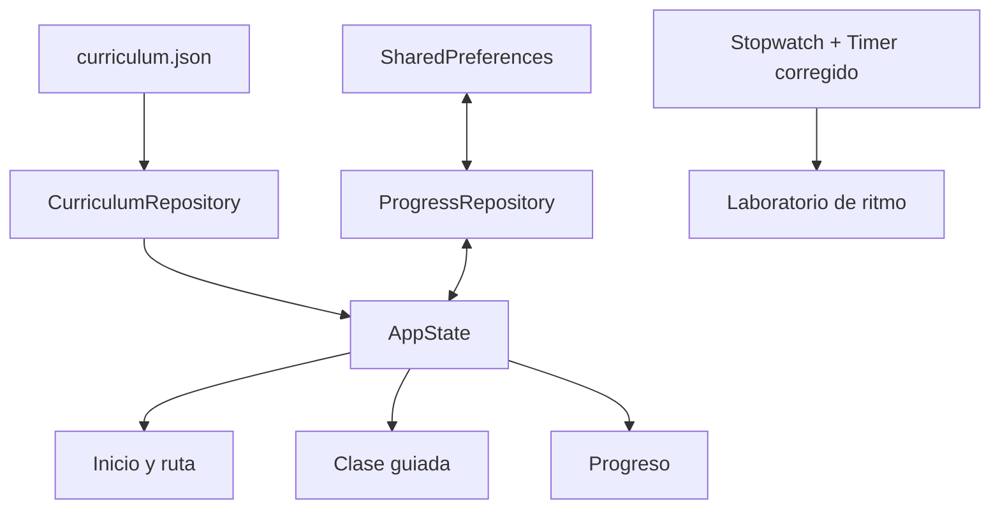

# Arquitectura

## Decisión principal

Flutter mantiene una sola base de interfaz y lógica para Android y Windows. El MVP es local-first: el contenido viaja dentro de la instalación y el progreso se guarda en el dispositivo.

## Capas

| Capa | Responsabilidad |
|---|---|
| `assets/content` | Fuente versionada de niveles, clases y actividades. |
| `domain` | Modelos inmutables sin dependencia de interfaz. |
| `data` | Carga del activo y persistencia local. |
| `state` | Progreso, próxima clase y cálculos por nivel. |
| `screens` | Navegación y experiencias completas. |
| `widgets` | Tarjetas y diagramas reutilizables. |

## Datos locales

Solo se persiste una lista de identificadores de clases completadas. No se almacena nombre, fecha de nacimiento, escuela, voz, imagen ni ubicación.

Las escrituras son transaccionales en el estado: primero se construye la lista nueva, después `SharedPreferences` confirma la operación y recién entonces la interfaz publica el cambio. Un fallo de disco no deja una clase falsamente completada ni borra el estado visible.

La clave incluye versión (`completed_lessons_v1`). Al cambiar el currículo, `AppState` cruza los identificadores guardados con los identificadores válidos y descarta referencias inexistentes.

## Contenido

`curriculum.json` es deliberadamente independiente de la interfaz. Esto permite:

- editar clases sin recompilar lógica;
- ejecutar validaciones automáticas;
- traducir en el futuro;
- incorporar paquetes territoriales;
- generar guías impresas a partir de la misma fuente.

Una versión futura debería añadir un esquema JSON formal y migraciones entre versiones.

## Plataformas

Los directorios `android/` y `windows/` se generan con `tool/bootstrap.*` usando las plantillas de la versión estable de Flutter instalada. `tool/configure_platforms.mjs` aplica nombre, Android API 24, metadatos y auditoría de permisos; `flutter_launcher_icons` deriva los iconos desde la fuente PNG versionada. Evitar almacenar plantillas antiguas reduce fallos al abrir el repositorio años después.

## Reloj del pulso

Un `Timer.periodic` acumula retrasos cuando el hilo visual se ocupa. El laboratorio usa un `Stopwatch` monotónico como referencia y temporizadores de un solo disparo calculados contra el instante objetivo de cada pulso. Si una llamada llega tarde, el siguiente intervalo se acorta para volver a la línea temporal en vez de sumar el error indefinidamente.

El clic del sistema y la respuesta háptica se emiten después de la actualización visual. Son salidas opcionales; no se abre ningún canal de captura.

## Frontera de permisos

La base Flutter no depende de plugins de cámara, micrófono, ubicación, red o analítica. El manifiesto Android generado se revisa antes de compilar y nuevamente en release. La pantalla Mi avance presenta esta frontera como parte del producto, no solo de la documentación.

## Evolución sin romper privacidad

### Música y video

Añadir un manifiesto local de activos con autor, intérprete, territorio, licencia, archivo y hash. No descargar contenido automáticamente durante una clase.

### Cámara opcional

La evaluación corporal futura debe ser un módulo separado:

1. activación explícita por una persona adulta;
2. inferencia en el dispositivo;
3. extracción temporal de puntos corporales;
4. descarte inmediato de cuadros;
5. retroalimentación sobre espacio o ritmo, no sobre apariencia;
6. funcionamiento completo de la app con el módulo desactivado.

### Panel docente

Primero debe funcionar con exportación manual y anónima. Una sincronización futura requiere modelo de amenaza, identidad adulta, retención limitada y revisión jurídica aplicable a datos de menores.
