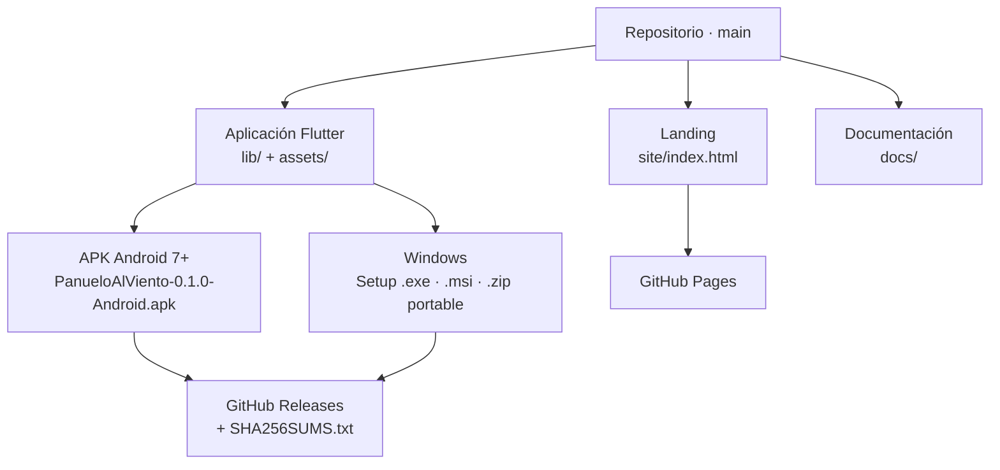

# 01 · Visión general del sistema

## En una frase

Una aplicación Flutter de escritorio y móvil que lleva un currículo de 24 clases
de cueca dentro de su propia instalación, guarda en el dispositivo qué clases se
completaron y no habla con ningún servidor.

## Qué hace

| Función | Dónde vive | Qué produce |
|---|---|---|
| Mostrar la próxima clase pendiente | `lib/screens/home_tab.dart` | Una sola acción destacada, no un catálogo. |
| Recorrer los 8 niveles y sus 24 clases | `lib/screens/route_tab.dart` | Lista desplegable con avance por nivel. |
| Guiar una clase | `lib/screens/lesson_screen.dart` | Contexto, esquema de piso, tres actividades marcables, reto, seguridad, alternativa accesible y consejo adulto. |
| Entrenar el pulso | `lib/screens/rhythm_lab_screen.dart` | Metrónomo visual de seis pulsos con dos agrupaciones y salidas opcionales de sonido y vibración. |
| Mostrar el avance y la frontera de privacidad | `lib/screens/progress_tab.dart` | Porcentaje total, porcentaje por nivel, estado de cámara y micrófono, y reinicio confirmado. |

## Qué no hace

Esta lista es tan importante como la anterior, porque delimita la promesa del
producto y está comprobada por herramientas del propio repositorio.

- No pide cuenta, nombre, edad, correo, escuela ni ubicación.
- No usa cámara ni micrófono: no hay botón, ni llamada, ni permiso.
- No hace llamadas de red. El APK publicado ni siquiera declara
  `android.permission.INTERNET`.
- No incluye música, video ni fotografía. La decisión es explícita: evita
  distribuir medios sin derechos verificables. Ver
  [`../CONTENT_LICENSES.md`](../CONTENT_LICENSES.md).
- No puntúa, no compara cuerpos, no ordena en un ranking y no penaliza repetir.
- No evalúa la postura ni el movimiento con sensores.
- No exporta ni importa el avance. Desinstalar lo pierde para siempre.

## Cifras del sistema, contadas

Todas obtenidas contando, no estimando.

| Magnitud | Valor | Cómo se obtuvo |
|---|---|---|
| Archivos Dart de producto | 15, en `lib/` | `wc -l lib/*.dart lib/*/*.dart` |
| Líneas Dart de producto | 2 417 (2 123 antes de documentar el código) | ídem |
| Archivos de prueba | 6, en `test/` | `wc -l test/*.dart` |
| Pruebas que ejecuta la suite | 25 | Salida de `flutter test`: `All tests passed!` con `+25` |
| Herramientas del repositorio | 11, en `tool/` | Listado del directorio |
| Workflows | 3 | `.github/workflows/` |
| Dependencias directas de ejecución | 1 (`shared_preferences: ^2.5.3`) | `pubspec.yaml` |
| Paquetes resueltos en total | 52 | `pubspec.lock` |
| Niveles / clases / actividades | 8 / 24 / 72 | `assets/content/curriculum.json` |
| Duración de cada clase | 12 minutos, las 24 | Campo `durationMinutes` de las 24 clases |
| Duración total del programa | 288 minutos | Suma de las 24 |
| Tamaño del currículo | 43 165 bytes | `wc -c assets/content/curriculum.json` |
| Capturas versionadas | 9 | `docs/screenshots/` |

## Superficies del producto

El diagrama muestra qué se produce a partir del repositorio y hacia dónde va.
No muestra el orden temporal ni las compuertas de calidad que hay entre medias:
eso está en [13 · Despliegue y operación](13-deployment-and-operations.md). Tampoco
muestra las carpetas `android/` y `windows/`, porque no existen en el
repositorio: se generan al compilar (ver [02 · Instalación](02-installation-and-execution.md)).

## Decisiones que explican el sistema

**El currículo es un dato, no código.** Vive en un único JSON dentro de
`assets/`. Eso permite editar clases sin recompilar lógica, validarlas con
herramientas que no necesitan Flutter, y —según
[`../ARCHITECTURE.md`](../ARCHITECTURE.md)— traducirlas o generar guías impresas
en el futuro. El precio es que no hay esquema JSON formal ni migraciones: hoy la
disciplina la ponen dos validadores y tres pruebas.

**El estado se pasa a mano.** No hay contenedor de inyección ni gestor de estado
global. `main` construye un `AppState` y lo entrega a la raíz. Con una sola
fuente de estado y quince archivos, un gestor global no resolvería ningún
problema existente y añadiría uno que entender.

**La persistencia es transaccional.** El estado en memoria solo cambia después
de que el disco confirme. Es la regla más protegida del proyecto: tiene tres
pruebas dedicadas en `test/app_state_test.dart` que existen específicamente para
impedir que alguien invierta el orden.

**El metrónomo no usa `Timer.periodic`.** Usa un `Stopwatch` monotónico y
temporizadores de un disparo calculados contra un instante absoluto, porque un
temporizador periódico acumula el retraso de cada tick y el metrónomo se queda
atrás sin recuperarse. Ver [06 · Explicación profunda](06-deep-code-explanation.md).

**La verificación mira el binario, no solo el repositorio.** `tool/verify_apk.mjs`
abre el APK compilado y cuenta las clases que trae dentro. Un repositorio
impecable puede producir un artefacto vacío, y un build en verde no lo detecta.

## Estado actual, sin adornos

`0.1.0` es **software verificado**: las 25 pruebas pasan, el análisis estático
está limpio, la coherencia entre manifiesto, historial, notas y README la
comprueba un validador, y el artefacto publicado se abrió y se midió.

No es todavía un **método pedagógico validado**. Faltan la revisión por docentes
de Educación Física, la de personas cultoras de las variantes representadas y la
prueba presencial con niñas y niños. Tampoco hay clave de firma Android
permanente, así que la primera actualización obligará a desinstalar y borrará el
avance local. El propio repositorio dice esto sin maquillarlo en
[`../VALIDATION_RESULT.md`](../VALIDATION_RESULT.md) y en el README; es una de
las propiedades que conviene proteger.

---

## Para una persona no técnica

Imagina un cuaderno de 24 lecciones para aprender a bailar cueca, pensado para
alguien de unos diez años. Cada lección cabe en doce minutos y siempre tiene la
misma forma: primero se descubre algo, después se practica, y al final se
piensa en lo que pasó. El cuaderno viene con un mapa dibujado del recorrido que
harán los pies, un aviso de seguridad y —esto importa— una manera alternativa de
hacerlo si alguien no puede moverse igual que los demás.

La aplicación es ese cuaderno metido dentro del teléfono o del computador. Y
está metido **de verdad**: todas las lecciones viajan dentro del programa, así
que funciona en un cerro sin señal, en una sala sin wifi o con el modo avión
puesto. No hay que registrarse, no hay que dar un correo y no hay anuncios.

Trae además un juguete rítmico: seis luces que se encienden por turno, como un
péndulo, para aprender a sentir el compás. Se le puede subir o bajar la
velocidad, y opcionalmente hacer que suene un clic o que el teléfono vibre en
los tiempos fuertes. Ese clic y esa vibración son cosas que la aplicación
*pide* al teléfono, como quien pide encender una lámpara. No son un micrófono:
no escuchan nada.

De hecho, la aplicación no tiene cámara ni micrófono en absoluto. Y no es una
promesa: hay tres comprobaciones automáticas que revisan el código, el archivo
de instalación a medio hacer y el archivo terminado, y bloquean la publicación si
alguna de las tres los encuentra. Lo único que la aplicación guarda es una lista
como «lección 1, lección 2, lección 5», y esa lista vive únicamente en el
aparato de quien la usa. Nadie más la ve.

**Lo que todavía no es.** El programa está bien construido, pero *bien
construido* y *pedagógicamente correcto* no son lo mismo. Ninguna profesora de
Educación Física ni ninguna persona cultora de cueca ha revisado todavía estas
24 lecciones y firmado que estén bien planteadas. Tampoco se ha probado con
niños de verdad en una sala. La aplicación lo dice de frente en su propia
documentación en vez de dar a entender lo contrario, y esa honestidad es una de
sus mejores propiedades.

Hay además un detalle práctico que conviene saber: por ahora, cuando salga una
versión nueva, probablemente habrá que borrar la anterior antes de instalarla, y
al borrarla se pierde la lista de lecciones completadas. Conviene anotarlas en
un papel antes. Es un problema conocido y tiene solución; simplemente todavía no
se ha aplicado.

## Continuar por

- [02 · Instalación y ejecución](02-installation-and-execution.md) para poner el
  proyecto en marcha.
- [03 · Arquitectura](03-architecture.md) para entender cómo encajan las piezas.
- [17 · Resumen ejecutivo](17-executive-summary.md) si hay que decidir algo.
