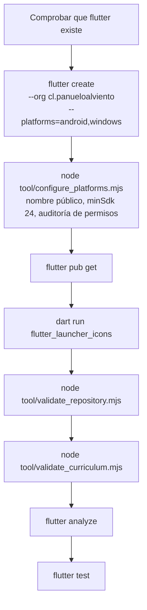

# 02 · Instalación y ejecución

## La sorpresa número uno al clonar

**`android/` y `windows/` no existen en el repositorio.** Están excluidas por
`.gitignore`:

```text
# Generated platform files are created by tool/bootstrap.* and CI.
/android/
/windows/
/release-artifacts/
```

Quien clone y ejecute `flutter run` sin más se encontrará con que no hay ninguna
plataforma disponible. No es un error: es una decisión declarada en
[`../ARCHITECTURE.md`](../ARCHITECTURE.md) —«evitar almacenar plantillas
antiguas reduce fallos al abrir el repositorio años después»—. Las plantillas
nativas se regeneran con la versión de Flutter que tengas instalada, y después
`tool/configure_platforms.mjs` les aplica la identidad del producto.

El paso obligatorio es, por tanto, ejecutar el bootstrap antes de cualquier otra
cosa.

## Requisitos

| Requisito | Versión | Para qué |
|---|---|---|
| Flutter estable | 3.44.6 fijada en CI; `pubspec.yaml` admite desde 3.29.0 | Todo |
| Dart | 3.12.2 (viene con Flutter 3.44.6); `pubspec.yaml` admite desde 3.7.0 | Todo |
| Node.js | Cualquiera con soporte de módulos ES. Verificado con v24.11.1 | Los 11 scripts de `tool/` |
| JDK 17 | — | Compilar Android |
| Android SDK con build-tools | — | Compilar y verificar el APK |
| Visual Studio 2022 con *Desktop development with C++* | — | Compilar Windows |
| Google Chrome | — | Solo para regenerar capturas |
| Python 3 con `markdown`, `xhtml2pdf`, `PyMuPDF` | Verificado con 3.12.9 | Solo para regenerar los PDF de esta carpeta |

La versión de Flutter no es una recomendación blanda: CI ejecuta
`dart format --set-exit-if-changed`, y el formateador cambia entre versiones. Con
otra versión el formato puede fallar aunque el código sea correcto. Está avisado
en [`../../CONTRIBUTING.md`](../../CONTRIBUTING.md).

## Puesta en marcha

### Windows

```powershell
.\tool\bootstrap.ps1
flutter run -d windows
```

### Linux y macOS, para Android

```bash
./tool/bootstrap.sh
flutter devices
flutter run -d <id-del-dispositivo>
```

Ambos scripts hacen lo mismo salvo que la versión PowerShell añade
`flutter config --enable-windows-desktop` antes de empezar:



El diagrama muestra la secuencia completa de `tool/bootstrap.ps1` y
`tool/bootstrap.sh`. Lo que no muestra: cada paso aborta el script si falla
—`$ErrorActionPreference = 'Stop'` en PowerShell, `set -euo pipefail` en Bash—,
de modo que el bootstrap es también una compuerta de calidad, no solo una
preparación.

`tool/configure_platforms.mjs` lanza una excepción si no encontró ninguna
plataforma que configurar (`No se encontró ninguna plataforma generada`), lo que
convierte el olvido de `flutter create` en un error explícito en vez de en una
compilación con el nombre genérico `panuelo_al_viento`.

## Ejecutar sin instalar Flutter

Buena parte de la verificación no necesita el toolchain. Es una propiedad
deliberada del proyecto:

```bash
node tool/validate_repository.mjs
node tool/validate_curriculum.mjs
node tool/build_site.mjs
```

Salida real de las tres, sobre el commit `6efae74`:

```text
Repositorio válido: 32 archivos esenciales, 9 capturas y versión 0.1.0+1 coherente en pubspec, CHANGELOG, notas y README.
Currículo válido: 8 niveles, 24 clases y 72 actividades.
Landing ensamblada en C:\dev\panuelo-al-viento-cueca-app\build\site: versión 0.1.0 en 5 lugares, 9 capturas y 9 imágenes comprobadas.
```

## Comandos de uso diario

| Comando | Para qué | Nota |
|---|---|---|
| `flutter pub get` | Resolver dependencias | `pubspec.lock` está versionado, así que resuelve igual en toda máquina |
| `flutter run -d windows` | Ejecutar en escritorio | Necesita `windows/` generado |
| `flutter test` | Las 25 pruebas | Unos 2 s |
| `flutter analyze` | Análisis estático | Unos 3 s en caliente, ~57 s en frío |
| `dart format --output=none --set-exit-if-changed lib test tool` | Compuerta de formato | Sin `--set-exit-if-changed` **el paso pasa siempre** |
| `dart run tool/validate_curriculum.dart` | Validador de currículo en Dart | Gemelo del `.mjs`; CI no lo ejecuta |
| `node tool/build_site.mjs --serve` | Landing en `http://127.0.0.1:8080` | Puerto configurable con `SITE_PORT` |
| `node tool/verify_apk.mjs <apk> [versión]` | Abrir y medir un APK | Necesita `aapt2` y `unzip` |
| `node tool/capture_screenshots.mjs` | Rehacer `docs/screenshots/` | Compila para web y conduce Chrome sin ventana |
| `python tool/build_docs_pdf.py` | Regenerar los PDF de esta carpeta | Ver [13](13-deployment-and-operations.md) |

## Dónde queda cada cosa al compilar

| Ruta | Contenido | ¿Versionada? |
|---|---|---|
| `build/app/outputs/flutter-apk/app-release.apk` | APK de Android | No, `build/` está ignorada |
| `build/windows/x64/runner/Release/` | Ejecutable, DLL y carpeta `data` | No |
| `build/site/` | Landing ensamblada | No |
| `docs/system-documentation/pdf/` | PDF de esta documentación | Sí |
| `release-artifacts/` | Artefactos con nombre final | No, ignorada |
| `.mermaid-cache/` | Diagramas rasterizados por el generador de PDF | No, ignorada |

El ZIP portable de Windows contiene la carpeta `Release` completa. Extraer solo
el `.exe` no funciona: necesita `flutter_windows.dll` y la carpeta `data`. Está
advertido en el README y en [`../BUILD_WINDOWS.md`](../BUILD_WINDOWS.md).

## Verificación del entorno usado en este análisis

```text
Flutter 3.44.6 • channel stable
Framework • revision ee80f08bbf • 2026-07-08
Engine • hash d3a3293399556a85388faf8c6f0723a7a5597aa8
Tools • Dart 3.12.2 • DevTools 2.57.0

node v24.11.1
Python 3.12.9
```

La ruta del SDK en la máquina de análisis fue `C:\dev\tools\flutter`, que no
estaba en el `PATH` de la sesión. Si `flutter` no responde, la ruta real puede
deducirse de `.dart_tool/package_config.json`, donde el paquete `flutter` apunta
al SDK que resolvió las dependencias.

## Continuar por

- [10 · Configuración](10-configuration.md) para las variables de entorno y los
  valores fijados.
- [14 · Troubleshooting](14-troubleshooting.md) si algo de lo anterior falla.
- [`../BUILD_MOBILE.md`](../BUILD_MOBILE.md) y
  [`../BUILD_WINDOWS.md`](../BUILD_WINDOWS.md) para el detalle por plataforma:
  siguen siendo la fuente autorizada de ese tema.
