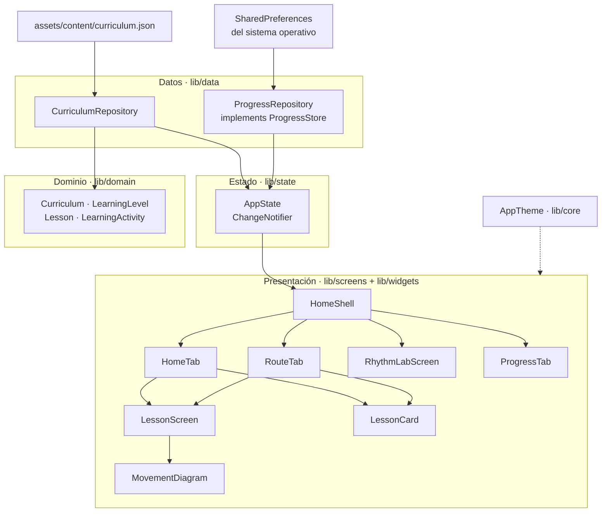
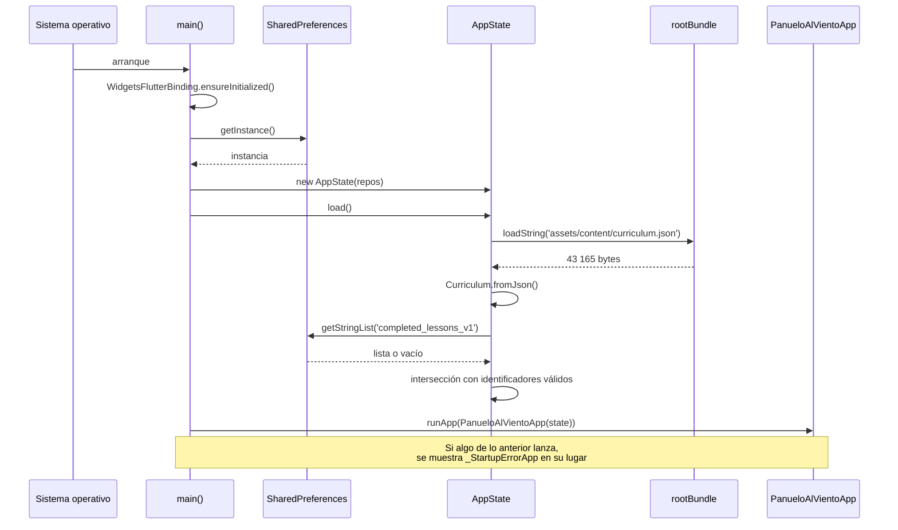

# 03 · Arquitectura

[`../ARCHITECTURE.md`](../ARCHITECTURE.md) es la fuente autorizada de la
**decisión** arquitectónica y de la evolución prevista. Este documento describe
la **estructura tal como está construida hoy**, con los símbolos concretos, y
nombra lo que ese documento no llega a cubrir.

## La forma del sistema

Cuatro capas, dependencia en un solo sentido, sin ciclos.



Lo que el diagrama muestra: las dependencias reales, comprobables leyendo los
`import` de cada archivo. `domain` no importa nada del proyecto ni de Flutter;
`data` importa `domain`; `state` importa `data` y `domain`; `screens` importan
`state`, `domain` y `widgets`.

Lo que **no** muestra: `RhythmLabScreen` no aparece conectada a `AppState`
porque no lo está —es la única pantalla sin estado compartido, y por eso su
constructor es `const`—; y `AppTheme` llega a todas las pantallas por el
`ColorScheme` de Material, no por importación directa salvo en dos casos
(`home_tab.dart` y `movement_diagram.dart` importan `AppColors` para colores
fijos).

## Las capas, con su regla

| Capa | Archivos | Regla que la define |
|---|---|---|
| `lib/domain` | 1 | Modelos inmutables. **Cero dependencias**, ni siquiera de Flutter. Eso permite que `test/curriculum_integrity_test.dart` construya el currículo leyendo el archivo sin levantar un entorno de widgets. |
| `lib/data` | 2 | Acceso a fuentes externas. `CurriculumRepository` solo lee; `ProgressRepository` lee y escribe. Ninguno decide nada. |
| `lib/state` | 1 | Única fuente de verdad en memoria. Contiene todas las reglas de negocio: qué clase es la próxima, qué avance es válido, en qué orden se persiste. |
| `lib/screens` · `lib/widgets` | 6 + 2 | Dibujan y disparan. No calculan progreso ni deciden validez. |
| `lib/core` | 1 | Paleta y tipografía. Sin lógica. |

## Las cinco decisiones que hay que entender

### 1. El contenido es dato, no código

Las 24 clases viven en un JSON de 43 165 bytes dentro de `assets/`. La
consecuencia práctica: cambiar una clase no recompila lógica y puede validarse
con Node, sin Flutter. La consecuencia menos evidente: **no hay esquema JSON
formal ni mecanismo de migración**. Si el formato cambia, lo único que avisa son
los dos validadores y las tres pruebas de integridad.
[`../ARCHITECTURE.md`](../ARCHITECTURE.md) reconoce ese hueco y lo deja como
trabajo futuro.

### 2. El estado se inyecta a mano, desde `main`

```dart
final state = AppState(
  curriculumRepository: const CurriculumRepository(),
  progressRepository: ProgressRepository(preferences),
);
await state.load();
runApp(PanueloAlVientoApp(state: state));
```

No hay `provider`, `riverpod`, `get_it` ni `InheritedWidget` propio. `HomeShell`
se suscribe con un `AnimatedBuilder` sobre el `ChangeNotifier` y reconstruye las
cuatro pestañas juntas.

Coste declarado: `AppState` viaja como parámetro por cinco constructores. Con
quince archivos eso es legible; a partir de cierto tamaño dejaría de serlo.
`INFERENCIA`: es el punto donde la arquitectura tendría que cambiar primero si el
producto crece.

Beneficio: las pruebas de widget construyen la aplicación con un currículo y un
avance conocidos sin tocar ningún contenedor global, y no hay estado residual
entre pruebas.

### 3. La persistencia se confirma antes de publicarse

El orden es siempre el mismo y está en `AppState.completeLesson`:

```dart
final updated = {..._completedLessonIds, lessonId};
await _progressRepository.writeCompletedLessonIds(updated);  // 1. confirmar
_completedLessonIds = updated;                                // 2. publicar
notifyListeners();                                            // 3. avisar
```

`ProgressRepository` lanza `StateError` si `SharedPreferences` devuelve `false`.
Si lanzara, el `await` propaga y las líneas 2 y 3 no se ejecutan: la interfaz
nunca muestra una clase completada que el disco no guardó.

Esta es la regla más protegida del proyecto. La interfaz separada `ProgressStore`
existe únicamente para poder inyectar un almacén que falle a voluntad y probarlo
(`test/app_state_test.dart`).

### 4. El pulso se agenda contra un reloj monotónico

`RhythmLabScreen` no usa `Timer.periodic`. Calcula el instante objetivo de cada
pulso como `microsPerPulse * (tick + 1)` sobre un `Stopwatch` y programa un
temporizador de un disparo con el tiempo que falte. Un retraso puntual acorta el
intervalo siguiente en vez de sumarse. El detalle línea a línea está en
[06 · Explicación profunda](06-deep-code-explanation.md).

### 5. La verificación se separa en dos planos

| Plano | Herramienta | Qué puede detectar que el otro no |
|---|---|---|
| Repositorio | `tool/validate_repository.mjs` | Que el README prometa una versión que el manifiesto no declara. |
| Binario | `tool/verify_apk.mjs` | Que el APK se instale sin currículo dentro, o con permisos que una dependencia añadió al fusionar manifiestos. |

`../ARCHITECTURE.md` lo resume mejor de lo que lo haría una paráfrasis: «un
repositorio impecable puede producir un artefacto equivocado, y esa es
exactamente la clase de fallo que un build en verde no detecta».

## Ciclo de vida de la aplicación



El diagrama muestra la única secuencia asíncrona del arranque. No muestra el
caso de error con detalle: cualquier excepción entre `getInstance()` y `load()`
se captura en `main`, se reporta con `FlutterError.reportError` y se sustituye
la aplicación completa por `_StartupErrorApp`, una pantalla sin reintento.

## Navegación

Dos mecanismos distintos, y la diferencia importa:

- **Entre las cuatro secciones**: no hay navegación. Un `IndexedStack` mantiene
  las cuatro vivas y cambia cuál se pinta. Conserva el desplazamiento de cada
  una y evita reconstruir listas.
- **Hacia una clase**: `Navigator.push` con `MaterialPageRoute`, desde
  `HomeTab` y desde `RouteTab`. `LessonScreen` es la única pantalla apilada.

La elección del `IndexedStack` tiene una consecuencia que ningún documento del
repositorio recogía y que aquí se documenta por primera vez: **el estado de las
pestañas no visibles sigue vivo**. Un pulso iniciado en el laboratorio continúa
sonando mientras se navega por las otras tres secciones. Está registrado como
hallazgo en [15 · Riesgos](15-risks-and-technical-debt.md) porque contradice el
paso 6 de [`../PERMISSIONS.md`](../PERMISSIONS.md).

## Adaptación a la pantalla

Un solo umbral, en `HomeShell`: `constraints.maxWidth >= 840`. Por encima,
`NavigationRail` lateral; por debajo, `NavigationBar` inferior. Se mide el ancho
disponible, no la plataforma, así que una ventana de escritorio estrecha se
comporta como un teléfono. Cada pantalla añade además su propio
`ConstrainedBox`: 1040 px en Inicio, 920 en Ruta, 860 en Clase y 820 en Ritmo y
Avance, para que el texto no se estire en un monitor ancho.

## Lo que la arquitectura hace bien y conviene no romper

- **La dirección de las dependencias.** `domain` sin importaciones es lo que
  permite validar el currículo sin Flutter. Meter un `import 'package:flutter/…'`
  ahí rompería tres pruebas y un validador a la vez.
- **El orden confirmar-luego-publicar.** Invertirlo produce el fallo más caro
  posible en este producto: avance que se ve y desaparece.
- **La única fuente de verdad de la versión.** `tool/app_version.mjs` lee
  `pubspec.yaml` y todo lo demás lo consume. El CHANGELOG documenta que antes no
  era así y que un tag `v0.2.0` habría publicado archivos llamados `0.1.0`.
- **La ausencia de dependencias.** Una sola dependencia de ejecución
  (`shared_preferences`) y 52 paquetes resueltos en total. Cada plugin nuevo es
  una vía por la que un permiso puede entrar en el manifiesto fusionado sin
  aparecer en el código.

## Continuar por

- [04 · Mapa del código](04-code-map.md) para el inventario archivo a archivo.
- [07 · Persistencia](07-database.md) para el mecanismo de guardado.
- [08 · Flujo de datos](08-data-flow.md) para el recorrido completo de un dato.
