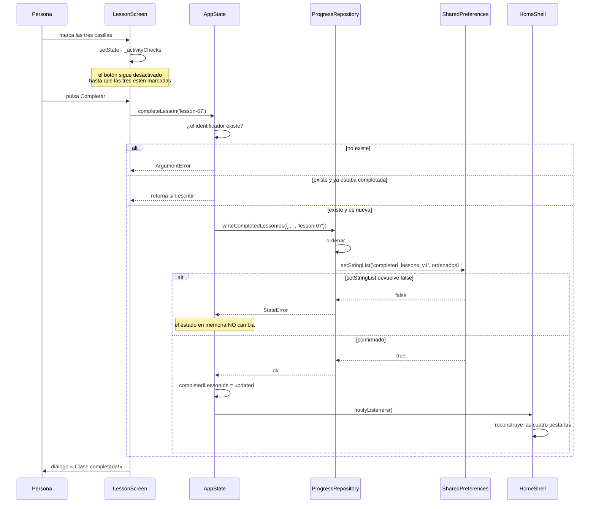
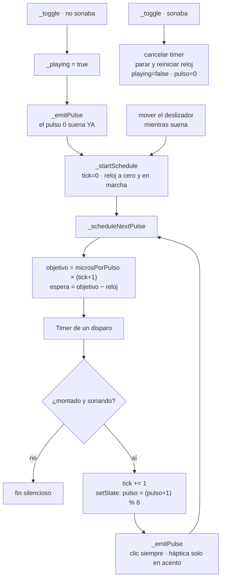
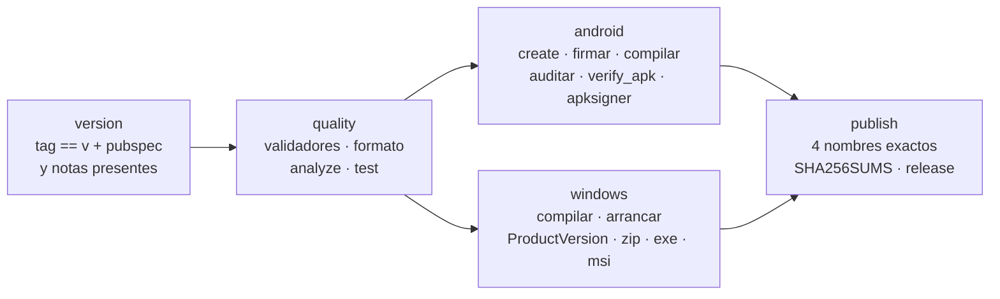

# 06 · Explicación profunda del código

Aquí se explica el sistema **flujo por flujo**, no archivo por archivo. Cada
flujo empieza en un gesto de la persona usuaria y termina donde ese gesto deja
de producir efectos.

---

## Flujo 1 · Arranque

**Empieza:** el sistema operativo lanza el proceso.
**Termina:** la primera imagen en pantalla.

`main()` es asíncrono y hace cuatro cosas en orden estricto:

```dart
WidgetsFlutterBinding.ensureInitialized();
final preferences = await SharedPreferences.getInstance();
final state = AppState(curriculumRepository: …, progressRepository: …);
await state.load();
runApp(PanueloAlVientoApp(state: state));
```

`ensureInitialized()` es obligatorio antes de tocar cualquier canal de
plataforma; sin él, `SharedPreferences.getInstance()` fallaría porque el canal
todavía no existe.

Dentro de `state.load()` ocurren dos operaciones distintas:

1. `CurriculumRepository.load()` pide a `rootBundle` los 43 165 bytes del JSON,
   los decodifica y construye el árbol de 8 niveles → 24 clases → 72 actividades.
   Cada `fromJson` hace *casts* explícitos: un campo ausente lanza `TypeError`
   aquí y no produce un objeto a medias que llegue a la interfaz.
2. Se lee el avance guardado y se **cruza** con los identificadores válidos.

El cruce es la línea que un lector nuevo pasaría por alto:

```dart
final validIds = curriculum.lessons.map((lesson) => lesson.id).toSet();
_completedLessonIds =
    _progressRepository.readCompletedLessonIds().intersection(validIds);
```

Sin él, retirar o renombrar una clase en una versión futura dejaría en el
almacén un identificador que ya no existe, contado para siempre en un
porcentaje que nunca podría llegar a 100 %. Con él, ese identificador
simplemente desaparece del cálculo. Nótese que **no se reescribe el almacén**:
el valor huérfano sigue en disco hasta la próxima escritura.

Toda esta secuencia está envuelta en un `try`. Si cualquier paso lanza:

```dart
FlutterError.reportError(FlutterErrorDetails(
  exception: error, stack: stackTrace, library: 'inicio de Pañuelo al Viento'));
runApp(const _StartupErrorApp());
```

`_StartupErrorApp` es una pantalla completa —no un diálogo— con un icono, un
título y una instrucción. No ofrece reintento, y es correcto: las causas
plausibles (activo corrompido, almacenamiento inaccesible) no se resuelven
repitiendo la misma operación en el mismo proceso. El texto evita jerga y evita
culpar a quien lee.

---

## Flujo 2 · Pintar el estado

**Empieza:** `AppState.notifyListeners()`.
**Termina:** la pantalla redibujada.

`HomeShell.build` envuelve todo en un `AnimatedBuilder(animation: widget.state)`.
Cualquier notificación reconstruye el subárbol completo de las cuatro pestañas.

Dentro, un `LayoutBuilder` decide la forma:

```dart
final wide = constraints.maxWidth >= 840;
```

Se mide el **ancho disponible**, no la plataforma. Una ventana de escritorio
estrecha se comporta como un teléfono, y eso se prueba sin emulador.

Las cuatro pantallas se construyen en una lista y se meten en un `IndexedStack`.
Aquí hay una decisión con consecuencias que conviene entender bien.

`IndexedStack` **construye y mantiene en el árbol a los cuatro hijos**; solo
pinta el que corresponde al índice. La ventaja buscada: cambiar de pestaña
conserva la posición de desplazamiento de cada lista y no rehace la Ruta de ocho
niveles cada vez.

La consecuencia no buscada: el `State` de las pestañas invisibles sigue vivo.
`_RhythmLabScreenState.dispose()` **no se ejecuta** al salir de Ritmo, así que su
temporizador sigue programando pulsos y `_emitPulse()` sigue pidiendo clics al
sistema mientras la persona está en Inicio, Ruta o Avance.

Esto se comprobó con una prueba temporal que arrancó el pulso, cambió a Inicio y
contó las señales emitidas: **se emitieron señales estando en otra pestaña**, y
al volver a Ritmo el botón seguía diciendo «Detener». Contradice el paso 6 de
[`../PERMISSIONS.md`](../PERMISSIONS.md) («Detener, cambiar de pantalla o cerrar
la app cancela el temporizador») y queda registrado en
[15 · Riesgos](15-risks-and-technical-debt.md) sin corregir.

---

## Flujo 3 · Completar una clase

**Empieza:** la persona pulsa «Completar esta clase».
**Termina:** el porcentaje actualizado en las cuatro pantallas.



El diagrama muestra las tres ramas posibles y, sobre todo, dónde se sitúa el
cambio de estado respecto de la confirmación del disco. Lo que no muestra: el
diálogo de celebración solo se alcanza si `completeLesson` no lanzó, porque el
`await` está antes; y `LessonScreen` hace un `setState` vacío al cerrarlo, para
que la barra superior pase a mostrar el chip «Completada».

Tres detalles del código que sostienen el flujo:

**El botón sólo se habilita con las tres casillas marcadas.**

```dart
onPressed: _allActivitiesChecked
    ? completed ? _finishRepeat : _complete
    : null,
```

`onPressed: null` es lo que desactiva un botón en Flutter. La etiqueta cambia en
paralelo entre cuatro textos según las dos condiciones, de modo que el botón
desactivado explica **por qué** lo está («Marca los tres pasos para terminar»)
en vez de quedarse mudo.

**Repetir no escribe.** Si la clase ya estaba completada, `_finishRepeat` no
toca la persistencia: limpia las casillas y muestra un `SnackBar` recordando que
el avance anterior sigue guardado. Sin ese aviso, desmarcar tres casillas parece
un retroceso.

**El identificador se valida contra el currículo, no contra el almacén.** Un
`ArgumentError` aquí impide que una errata de contenido contamine el disco.

---

## Flujo 4 · Reiniciar el avance

**Empieza:** «Reiniciar el avance» en Mi avance.
**Termina:** el almacén vacío o el avance intacto.

`ProgressTab._confirmReset` abre un `AlertDialog` que devuelve `bool?`. Solo
`confirmed == true` procede: cerrar el diálogo tocando fuera devuelve `null` y no
borra nada.

`AppState.resetProgress()` sigue el mismo orden que `completeLesson`: primero
`clear()`, que lanza si no se confirmó, y solo después vacía el conjunto en
memoria. Si el borrado falla, el avance visible **se mantiene**. Es preferible a
mostrar cero clases y que reaparezcan al reiniciar la aplicación.

El borrado es irreversible: no hay copia en la nube ni exportación en 0.1.0. La
confirmación es el único freno que existe.

---

## Flujo 5 · El metrónomo

**Empieza:** «Comenzar».
**Termina:** «Detener», o el cierre de la aplicación.

Este es el flujo con más densidad técnica del proyecto, y la razón está en un
problema que no se ve hasta que se practica varios minutos.

### El problema que resuelve

`Timer.periodic(Duration(milliseconds: 714), …)` parece la solución obvia para
84 pulsos por minuto. No lo es. Un temporizador periódico vuelve a contar desde
el momento en que **se ejecutó** la devolución de llamada anterior. Si el hilo
visual estaba ocupado y el tick llegó 30 ms tarde, el siguiente se programa 714 ms
después de ese instante ya retrasado. Los errores se suman y no se recuperan
nunca: al cabo de unos minutos el metrónomo va notoriamente atrasado respecto a
la música con la que se está practicando.

### La solución

Tres piezas:

```dart
final Stopwatch _clock = Stopwatch();   // referencia monotónica
int _scheduledTick = 0;                 // cuántos pulsos van programados
Timer? _timer;                          // un disparo, no periódico
```

Y el cálculo:

```dart
final microsPerPulse = 60000000 / _bpm;
final targetMicros   = (microsPerPulse * (_scheduledTick + 1)).round();
final remainingMicros = targetMicros - _clock.elapsedMicroseconds;
_timer = Timer(Duration(microseconds: remainingMicros > 0 ? remainingMicros : 0), …);
```

El objetivo del pulso *n* es siempre `n × microsPerPulse` **desde el inicio**, no
desde el pulso anterior. Si el pulso 10 se ejecutó tarde, `remainingMicros` para
el 11 sale más pequeño y el intervalo se acorta solo. Si el retraso fue mayor que
un pulso entero, `remainingMicros` sale negativo y el `> 0 ? … : 0` dispara
inmediatamente para recuperar terreno. La serie vuelve a la línea temporal en vez
de arrastrar el error.

Se usan microsegundos y no milisegundos porque a 120 PPM el intervalo es
500 000 µs exactos, pero a 84 PPM son 714 285,71 µs: redondear a milisegundos
introduciría un error sistemático de hasta medio milisegundo por pulso que, sobre
cientos de pulsos, es precisamente la deriva que se intenta evitar.

### El ciclo completo



El diagrama muestra el bucle y sus dos salidas. Lo que no muestra: `_emitPulse`
se llama **después** de `setState`, de modo que la señal visual se dibuja antes
de pedir sonido y vibración; y la rama `SLIDER` reinicia la línea temporal desde
cero, para que un cambio de tempo se note de inmediato en vez de esperar a que
venza el intervalo ya programado.

### Las salidas

```dart
if (_sound) SystemSound.play(SystemSoundType.click);
if (_vibration && accent) HapticFeedback.mediumImpact();
```

El clic en cada pulso; la háptica **solo en acentos**, para que la vibración
marque la agrupación y no sea un zumbido continuo. Ninguna de las dos lee el
entorno: se piden al sistema operativo, que puede ignorarlas. En Windows la
háptica normalmente no existe y la ausencia no se trata como error.

Los acentos vienen de un `switch` de expresión exhaustivo:

```dart
_PulsePattern.sixEight  => const [0, 3],      // 3+3
_PulsePattern.threeFour => const [0, 2, 4],   // 2+2+2
```

Al ser exhaustivo, añadir un valor a `_PulsePattern` rompe la compilación aquí.
Es el comportamiento deseado: obliga a decidir sus acentos.

---

## Flujo 6 · Dibujar un esquema de piso

**Empieza:** `LessonScreen` construye `MovementDiagram(pattern: lesson.diagram)`.
**Termina:** píxeles y una etiqueta semántica.

Dos caminos independientes desde la misma clave:

| Camino | Función | Ramas |
|---|---|---|
| Visual | `_MovementPainter.paint` | `circle`, `eight`, `semicircle`, `steps`, `wave`, `default` |
| Semántico | `MovementDiagram._description` | `circle`, `eight`, `semicircle`, `steps`, `pair`, `wave`, comodín |

Los dos caminos **no cubren el mismo conjunto**. El currículo usa siete valores;
el pintor dibuja cinco trazos distintos y manda `pair` y `free` a la rama por
defecto —una línea recta entre las dos figuras—, mientras la descripción textual
sí distingue `pair` («dos personas dialogando con distancia») y manda `free` al
comodín. Resultado: cuatro clases con `pair` y tres con `free` muestran el mismo
dibujo, y quien use un lector de pantalla recibe descripciones distintas de un
esquema idéntico. Registrado en [15 · Riesgos](15-risks-and-technical-debt.md).

Todas las coordenadas son fracciones de `size`, nunca píxeles: el mismo esquema
es legible en un teléfono estrecho y en una ventana de escritorio. `eight` se
genera paramétricamente recorriendo `t` de 0 a 2π en pasos de 0,03 —unos 210
segmentos— con `sin(t)` en el eje horizontal y `sin(2t)` en el vertical, que es
una curva de Lissajous en forma de ocho.

Los colores del lienzo se eligen a mano en vez de tomarse del `ColorScheme`,
porque el dibujo pinta su propio fondo y debe contrastar con **él**, no con la
tarjeta que lo contiene. Contrapartida: las dos figuras usan `AppColors.red` y
`AppColors.blue` fijos en ambos modos, y ese par no lo mide
`test/theme_contrast_test.dart`, que solo cubre colores del `ColorScheme`.

---

## Flujo 7 · Publicar una versión

**Empieza:** un tag `v*`.
**Termina:** cuatro archivos y sus hashes en GitHub Releases.

Cinco jobs encadenados en `.github/workflows/release.yml`:



El diagrama muestra el orden y el paralelismo. Lo que no muestra: cada job
**rechaza** en vez de avisar. El job `version` aborta si el tag no es `v` + la
versión del manifiesto; el job `publish` aborta si sobra o falta cualquiera de
los cuatro nombres esperados. Esa severidad es lo que impide publicar archivos
con la versión equivocada, un fallo que el CHANGELOG documenta haber tenido
antes de existir `tool/app_version.mjs`.

La comprobación que más aporta es `node tool/verify_apk.mjs`: extrae
`assets/flutter_assets/assets/content/curriculum.json` del APK, cuenta niveles y
clases y compara su SHA-256 con el del archivo del repositorio. Detecta el fallo
silencioso por excelencia: un paquete que compila, se firma y cuadra en checksum
pero se instala sin contenido.

---

## Continuar por

- [07 · Persistencia](07-database.md) para el detalle del almacenamiento.
- [08 · Flujo de datos](08-data-flow.md) para el recorrido completo del dato.
- [15 · Riesgos](15-risks-and-technical-debt.md) para los hallazgos citados aquí.
