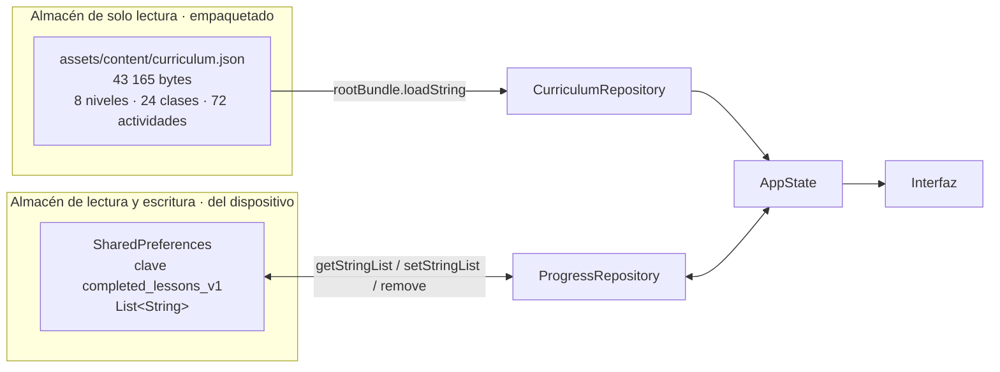
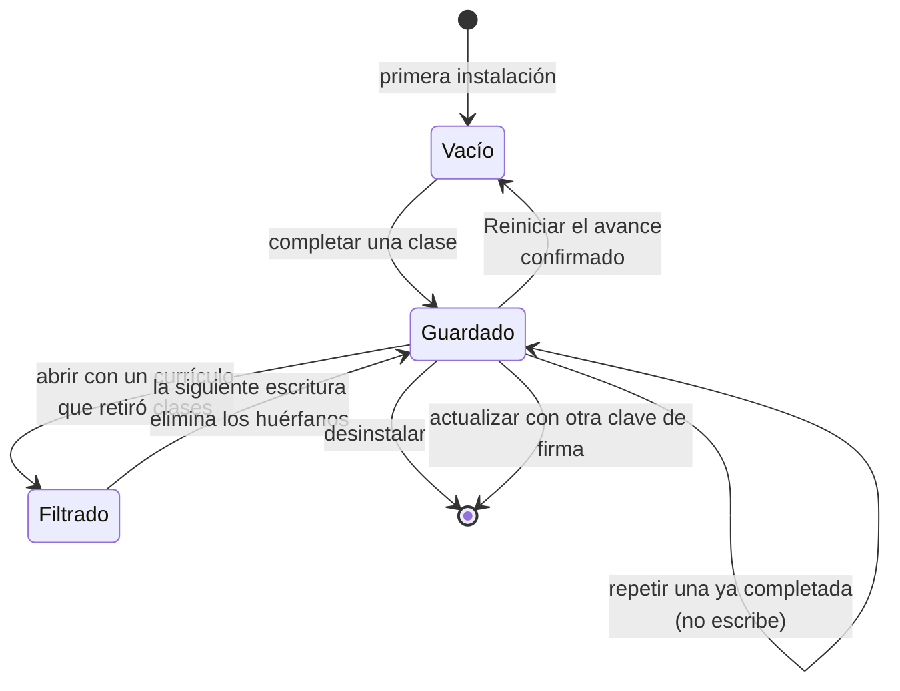

# 07 · Persistencia

## No hay base de datos, y se puede demostrar

El sistema **no usa ningún motor de base de datos**: ni SQLite, ni Hive, ni
Isar, ni Drift, ni ObjectBox, ni un servidor remoto. No hay migraciones ni
esquema SQL.

Comprobación, no opinión:

```bash
$ grep -rniE "sqlite|sqflite|drift|moor|hive|isar|objectbox|realm|postgres|mysql|mongo" lib/ test/ tool/ pubspec.yaml
# sin resultados

$ grep -c "^  [a-z_]*:$" pubspec.lock
52          # 52 paquetes resueltos, ninguno de base de datos
```

La única dependencia de ejecución declarada en `pubspec.yaml` es
`shared_preferences: ^2.5.3`.

Este documento describe, entonces, **el mecanismo de persistencia que sí
existe**, que son dos almacenes de naturaleza muy distinta.

## Los dos almacenes



El diagrama muestra la separación fundamental: el contenido nunca se escribe y
el avance nunca se lee de la red. Lo que no muestra: dónde vive físicamente cada
uno, que es lo que se detalla más abajo, ni que el cruce entre ambos ocurre una
sola vez, en `AppState.load()`.

| | Currículo | Avance |
|---|---|---|
| Naturaleza | Activo empaquetado en el binario | Preferencias del sistema operativo |
| Acceso | Solo lectura | Lectura y escritura |
| Formato | JSON UTF-8 | Lista de cadenas |
| Tamaño | 43 165 bytes fijos | Como máximo 24 cadenas de 9 caracteres |
| Cambia con | Una nueva instalación | Cada clase completada o el reinicio |
| Sobrevive a | Todo, es el binario | La actualización con la misma clave de firma; **no** a la desinstalación |
| Módulo que lo usa | `CurriculumRepository` | `ProgressRepository` |

---

## Almacén 1 · El currículo

### Dónde está

En el repositorio, `assets/content/curriculum.json`. Dentro del APK,
`assets/flutter_assets/assets/content/curriculum.json` —ruta que
`tool/verify_apk.mjs` extrae literalmente para comprobar que el contenido llegó
al paquete—. En Windows, dentro de la carpeta `data` que acompaña al ejecutable,
razón por la cual el ZIP portable no puede extraerse a medias.

### Diccionario de datos

#### Raíz

| Campo | Tipo | Obligatorio | Valor en 0.1.0 | Notas |
|---|---|---|---|---|
| `version` | string | Sí | `"1.0.0"` | Versión **del currículo**, independiente de `pubspec.yaml`. Ningún validador la comprueba. |
| `title` | string | Sí | `"Pañuelo al Viento"` | No se muestra en la interfaz. |
| `audience` | string | Sí | Descripción del público objetivo | No se muestra en la interfaz. |
| `levels` | array | Sí | 8 elementos | Los validadores exigen exactamente 8. |

`title` y `audience` se modelan en `Curriculum` pero ninguna pantalla los lee.
`NO DOCUMENTADO EN EL REPOSITORIO`: por qué se conservan.

#### `levels[]` → `LearningLevel`

| Campo | Tipo | Obligatorio | Restricción validada |
|---|---|---|---|
| `id` | string | Sí | Único. `level-01` … `level-08` |
| `order` | int | Sí | 1–8 |
| `title` | string | Sí | — |
| `subtitle` | string | Sí | — |
| `emoji` | string | Sí | Se dibuja a 32 px en Ruta y 30 px en Avance |
| `lessons` | array | Sí | **Exactamente 3** |

Valores reales:

| `id` | `order` | `title` | `emoji` | Clases |
|---|---:|---|:---:|---|
| `level-01` | 1 | Descubro la cueca | 🌟 | 1–3 |
| `level-02` | 2 | Pañuelo y saludo | 🤍 | 4–6 |
| `level-03` | 3 | Vueltas y recorridos | 🌀 | 7–9 |
| `level-04` | 4 | Pasos que conversan | 👣 | 10–12 |
| `level-05` | 5 | Diálogo en pareja | 🤝 | 13–15 |
| `level-06` | 6 | Zapateo y remate | ⚡ | 16–18 |
| `level-07` | 7 | Música y creación | 🎶 | 19–21 |
| `level-08` | 8 | Cuecas de Chile y presentación | 🇨🇱 | 22–24 |

El título del nivel 8 es `Cuecas de Chile y presentación`. Tanto
[`../CURRICULUM.md`](../CURRICULUM.md) como el diagrama del README lo llaman
«Diversidad y presentación». Registrado en
[15 · Riesgos](15-risks-and-technical-debt.md).

#### `levels[].lessons[]` → `Lesson`

| Campo | Tipo | Obligatorio | Restricción validada | Dónde se muestra |
|---|---|---|---|---|
| `id` | string | Sí | Único entre las 24. `lesson-01` … `lesson-24` | Nunca visible; **es la clave que se persiste** |
| `order` | int | Sí | 1–24 sin saltos ni repetición | Número de la tarjeta y título «Clase N» |
| `title` | string | Sí | No vacío | Tarjeta y encabezado |
| `durationMinutes` | int | Sí | Igual a la suma de sus actividades; entre 10 y 15 según la prueba | Tarjeta y encabezado |
| `objective` | string | Sí | No vacío | Tarjeta y encabezado |
| `why` | string | Sí | No vacío | Tarjeta destacada de la clase |
| `diagram` | string | Sí | No vacío. **Ningún validador comprueba que el valor tenga dibujo** | `MovementDiagram` |
| `activities` | array | Sí | Exactamente 3 | Las tres casillas |
| `challenge` | string | Sí | No vacío | Tarjeta «Reto de la clase» |
| `safety` | string | Sí | No vacío | Tarjeta «Baila con cuidado» |
| `accessibility` | string | Sí | No vacío | Tarjeta «Otra manera de hacerlo» |
| `teacherTip` | string | Sí | No vacío | Tarjeta «Para quien acompaña» |

Las 24 clases duran **exactamente 12 minutos**. La prueba de integridad admite
el rango 10–15 y varios documentos hablan de «clases de 10 a 15 minutos», pero
en los datos no hay ninguna variación.

Valores de `diagram` y su frecuencia:

| Valor | Clases | ¿Tiene dibujo propio? | ¿Tiene descripción propia? |
|---|---:|---|---|
| `circle` | 4 | Sí | Sí |
| `eight` | 4 | Sí | Sí |
| `steps` | 4 | Sí | Sí |
| `pair` | 4 | **No**, cae en la rama por defecto | Sí |
| `semicircle` | 3 | Sí | Sí |
| `free` | 3 | **No**, cae en la rama por defecto | No, cae en el comodín |
| `wave` | 2 | Sí | Sí |

#### `levels[].lessons[].activities[]` → `LearningActivity`

| Campo | Tipo | Obligatorio | Valores reales |
|---|---|---|---|
| `type` | string | Sí | `discover` 5 · `observe` 16 · `move` 22 · `listen` 4 · `create` 7 · `reflect` 18 |
| `title` | string | Sí | — |
| `instruction` | string | Sí | — |
| `minutes` | int | Sí | 3, 4 o 5 |

Un `type` desconocido **no rompe**: `activityTypeFromJson` degrada a `discover`.
Los validadores tampoco lo comprueban, porque el valor no cambia lo que se
muestra.

### Quién lo valida

| Herramienta | Comprueba |
|---|---|
| `tool/validate_curriculum.mjs` | 8 niveles, 24 clases, 3 clases por nivel, identificadores únicos, órdenes 1–24 sin huecos, 3 actividades por clase, suma de minutos, ocho campos de texto no vacíos |
| `tool/validate_curriculum.dart` | Lo mismo, en Dart. **Duplicado**; CI no lo ejecuta |
| `test/curriculum_integrity_test.dart` | Lo mismo más el rango 10–15 minutos, cargándolo por el modelo real |
| `tool/verify_apk.mjs` | Que el JSON **dentro del APK** tenga niveles y clases y su SHA-256 coincida con el del repositorio |

Ninguno comprueba que `diagram` sea un valor con dibujo, ni que `type` sea un
valor del enum, ni que `version` avance.

---

## Almacén 2 · El avance

### Qué se guarda, exactamente

Una única entrada:

| Aspecto | Valor |
|---|---|
| Clave | `completed_lessons_v1` |
| Tipo | `List<String>` |
| Contenido | Identificadores de clases completadas, **ordenados alfabéticamente** |
| Ejemplo | `["lesson-01", "lesson-02", "lesson-05"]` |
| Máximo | 24 cadenas de 9 caracteres |

Y nada más. No hay marcas de tiempo, ni puntuaciones, ni tiempo de práctica, ni
casillas marcadas, ni velocidad preferida del metrónomo, ni preferencia de
sonido o vibración. Las casillas de una clase a medias y los interruptores del
laboratorio son estado en memoria y se pierden al cerrar.

Ese mínimo no es una carencia: es el inventario declarado en
[`../PRIVACY.md`](../PRIVACY.md), que sigue siendo la fuente autorizada de qué
datos infantiles trata el producto y por qué.

### Dónde vive físicamente

`shared_preferences` delega en el mecanismo nativo de cada plataforma:

| Plataforma | Mecanismo | Consecuencia práctica |
|---|---|---|
| Android | `SharedPreferences` del sistema, en el almacenamiento privado de la app | Se borra al desinstalar o al limpiar datos. Sobrevive a una actualización **solo si la clave de firma es la misma** |
| Windows | Perfil del usuario, fuera de la carpeta de instalación | Por eso la versión portable también recuerda el avance; reinstalar con EXE o MSI normalmente lo conserva |

`REQUIERE VALIDACIÓN`: las rutas exactas no están declaradas en el repositorio y
no se comprobaron en un dispositivo real.
[`../BUILD_WINDOWS.md`](../BUILD_WINDOWS.md) es la fuente autorizada del
comportamiento en escritorio.

### El versionado de la clave

El sufijo `_v1` reserva la posibilidad de cambiar el formato leyendo la clave
antigua y escribiendo una nueva. **Ese mecanismo de migración no existe todavía**:
hoy el sufijo es solo una convención previsora. Cambiar la clave sin escribir la
migración dejaría huérfano el avance de todos los dispositivos instalados.

### El contrato transaccional

La propiedad más importante de este almacén no es lo que guarda, sino **cuándo**
lo publica.

```dart
// AppState.completeLesson
final updated = {..._completedLessonIds, lessonId};
await _progressRepository.writeCompletedLessonIds(updated);  // puede lanzar
_completedLessonIds = updated;
notifyListeners();
```

`ProgressRepository` lanza `StateError` si `setStringList` o `remove` devuelven
`false`. Si lanza, el `await` propaga y las dos líneas siguientes no se ejecutan.
La interfaz nunca muestra un avance que el disco no confirmó.

Tres pruebas de `test/app_state_test.dart` protegen esto inyectando un
`ProgressStore` en memoria que falla a voluntad:

| Prueba | Simula | Comprueba |
|---|---|---|
| «rechaza una clase inexistente sin alterar el avance» | Identificador falso | `ArgumentError` y almacén intacto |
| «solo publica el avance después de guardarlo correctamente» | Escritura fallida | `StateError` y `completedLessonIds` vacío |
| «solo borra el avance en memoria después de borrar el guardado» | Borrado fallido | `StateError` y avance anterior conservado |

### Ciclo de vida del dato



El diagrama muestra todas las transiciones posibles del avance. Lo que no
muestra: el estado «Filtrado» es solo en memoria —el disco sigue conteniendo el
identificador huérfano hasta la próxima escritura—, y las dos transiciones a
`[*]` son irreversibles porque no hay exportación ni copia remota en 0.1.0.

### Lo que se pierde, y cuándo

Conviene decirlo sin rodeos, porque es lo que sorprende a una familia:

- **Desinstalar borra el avance.** No hay recuperación.
- **Actualizar con una clave de firma distinta** obliga a desinstalar primero, y
  por tanto borra el avance. El APK `0.1.0` está firmado con una clave efímera
  generada durante la compilación, así que **esto ocurrirá con la primera
  actualización** salvo que antes se configure la firma permanente. Está
  advertido en el README, en la landing, en las notas de la versión y en
  [`../PARENT_GUIDE.md`](../PARENT_GUIDE.md), que recomienda anotar las clases
  en papel.
- **Limpiar los datos de la aplicación** desde el sistema lo borra.
- Cerrar la aplicación **no** borra nada.

## Continuar por

- [08 · Flujo de datos](08-data-flow.md) para el recorrido completo.
- [11 · Seguridad](11-security.md) para la superficie del almacenamiento local.
- [`../PRIVACY.md`](../PRIVACY.md) para el inventario de datos infantiles.
