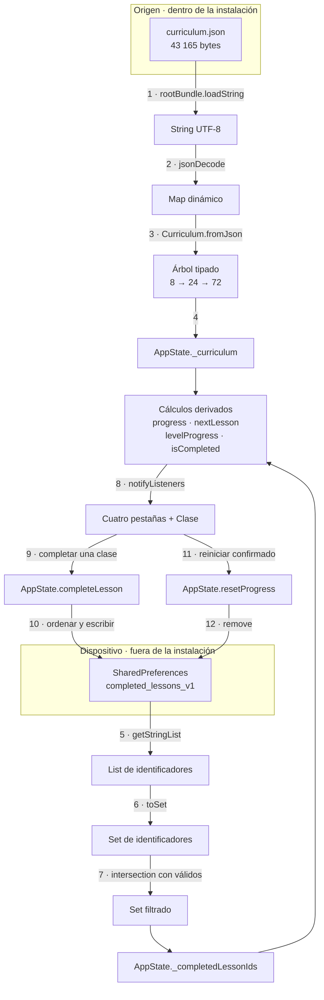
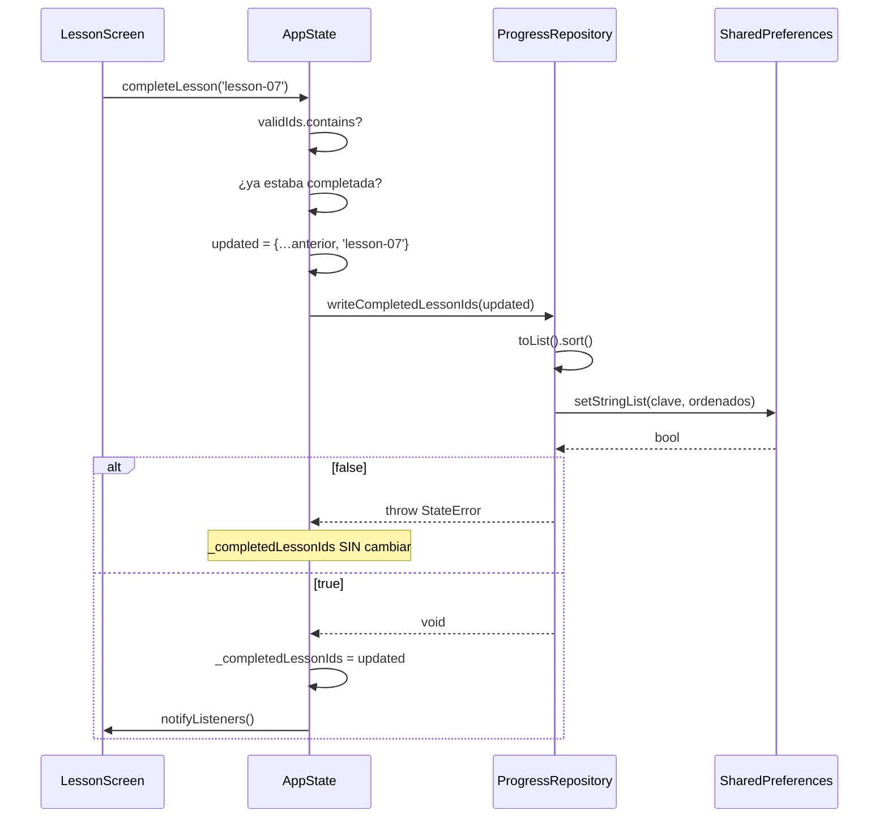

# 08 · Flujo de datos

## La conclusión primero

Solo hay **dos** flujos de datos en todo el sistema, y ninguno cruza la red.
Uno va del binario a la pantalla y no vuelve. El otro va de la pantalla al disco
del dispositivo y vuelve al abrir. Ese es todo el movimiento de información que
existe.

## Mapa completo

El diagrama muestra las doce transformaciones que sufre un dato en este sistema,
de principio a fin. Lo que **no** muestra, y conviene decir: no hay ninguna
flecha que salga del recuadro del dispositivo. No existe serialización hacia
red, ni exportación a archivo, ni telemetría, ni caché. Tampoco muestra el
camino de error, que se detalla más abajo.

## Flujo de lectura del currículo

| Paso | Operación | Dónde | Puede fallar con |
|---:|---|---|---|
| 1 | `rootBundle.loadString('assets/content/curriculum.json')` | `CurriculumRepository.load` | `FlutterError` si el activo no está en el bundle |
| 2 | `jsonDecode(source) as Map<String, dynamic>` | ídem | `FormatException` si el JSON es inválido |
| 3 | `Curriculum.fromJson(json)` | `lib/domain/curriculum.dart` | `TypeError` si falta un campo o el tipo no coincide |
| 4 | Asignación a `_curriculum` | `AppState.load` | — |

Los tres fallos posibles suben sin capturarse hasta `main`, que los reporta con
`FlutterError.reportError` y muestra `_StartupErrorApp`. El paso 3 es
deliberadamente estricto: es preferible fallar al arrancar que producir una
clase a medias que llegue a la interfaz con un campo vacío.

**Este flujo ocurre una sola vez por ejecución.** No hay recarga, no hay
invalidación y el árbol resultante es inmutable.

## Flujo de lectura del avance

| Paso | Operación | Detalle |
|---:|---|---|
| 5 | `getStringList('completed_lessons_v1')` | Devuelve `const <String>[]` si la clave no existe |
| 6 | `.toSet()` | Elimina duplicados que pudieran haber quedado |
| 7 | `.intersection(validIds)` | Descarta identificadores que el currículo actual no declara |

El paso 7 es el que evita que un porcentaje quede atascado para siempre si una
versión futura retira una clase. Detalle importante: el filtrado es **solo en
memoria**. El identificador huérfano sigue en el disco hasta la próxima
escritura, momento en el que desaparece porque `completeLesson` escribe el
conjunto ya filtrado, no el original.

## Cálculos derivados

Nada de esto se almacena. Se recalcula en cada lectura desde las dos únicas
fuentes de verdad.

| Valor | Fórmula | Coste | Quién lo consume |
|---|---|---|---|
| `totalCount` | `curriculum.lessons.length` | Aplana y ordena 24 elementos | `_ProgressCard` |
| `completedCount` | `_completedLessonIds.length` | O(1) | `_ProgressCard`, `_HeroProgress` |
| `progress` | `completedCount / totalCount`, o 0 | O(n log n) por `totalCount` | Barras y porcentajes |
| `nextLesson` | Primera clase sin completar en orden global | O(n) sobre lista ya ordenada | `HomeTab` |
| `levelProgress(level)` | Completadas del nivel / 3 | O(3) | Ruta y Avance |
| `isCompleted(id)` | Pertenencia al conjunto | O(1) | Cada `LessonCard` |

`ProgressTab` invoca `levelProgress(level)` **dos veces** por nivel en el mismo
`build`: una para la barra y otra para el porcentaje. Son 16 llamadas triviales;
se anota porque es el tipo de detalle que crece mal si el currículo se amplía.

## Flujo de escritura

Lo que el diagrama muestra: el punto exacto donde el estado en memoria se
sincroniza con el disco, y que ese punto está **después** de la confirmación. Lo
que no muestra: que `AppState` construye `updated` como un conjunto nuevo en vez
de mutar el existente, lo que garantiza que el conjunto anterior siga íntegro si
la escritura falla.

Se escribe **siempre el conjunto completo**, no un delta. Con 24 elementos como
máximo no compensa complicarlo, y escribir el total elimina toda posibilidad de
que un delta perdido deje el almacén inconsistente.

## Datos que nunca se guardan

Esta lista importa tanto como el flujo:

| Dato | Dónde vive | Se pierde al |
|---|---|---|
| Casillas marcadas de una clase a medias | `_LessonScreenState._activityChecks` | Salir de la clase |
| Velocidad del metrónomo (`_bpm`) | `_RhythmLabScreenState` | Cerrar la aplicación |
| Interruptores de sonido y vibración | ídem | Cerrar la aplicación |
| Agrupación rítmica elegida | ídem | Cerrar la aplicación |
| Pestaña seleccionada | `_HomeShellState._selectedIndex` | Cerrar la aplicación |
| Niveles desplegados en Ruta | `ExpansionTile` interno | Cerrar la aplicación |

`INFERENCIA`: no persistir las preferencias del metrónomo es coherente con la
decisión de guardar lo mínimo, pero significa que quien practica cada día vuelve
a encontrar 84 PPM y ambas salidas encendidas. Ningún documento del repositorio
declara si eso es intencionado.

## Flujo de datos fuera de la aplicación

Los otros flujos del repositorio no tocan datos de personas usuarias, pero
existen y conviene tenerlos mapeados:

| Flujo | Origen | Destino | Herramienta |
|---|---|---|---|
| Versión | `pubspec.yaml` | Landing, nombres de artefacto, comprobación del APK, tag de la release | `tool/app_version.mjs` |
| Capturas | Aplicación web servida en localhost | `docs/screenshots/*.png` | `tool/capture_screenshots.mjs` |
| Landing | `site/` + capturas + `logo.svg` | `build/site/` → GitHub Pages | `tool/build_site.mjs` |
| Currículo empaquetado | APK | Comparación SHA-256 con el del repositorio | `tool/verify_apk.mjs` |

El flujo de la versión es el más consecuente: un único punto de verdad
alimentando cinco destinos. El CHANGELOG documenta que antes no era así y que un
tag `v0.2.0` habría publicado archivos llamados `0.1.0`.

## Continuar por

- [07 · Persistencia](07-database.md) para el detalle del almacenamiento.
- [09 · APIs e integraciones](09-apis-and-integrations.md) para la demostración
  de que no hay red.
