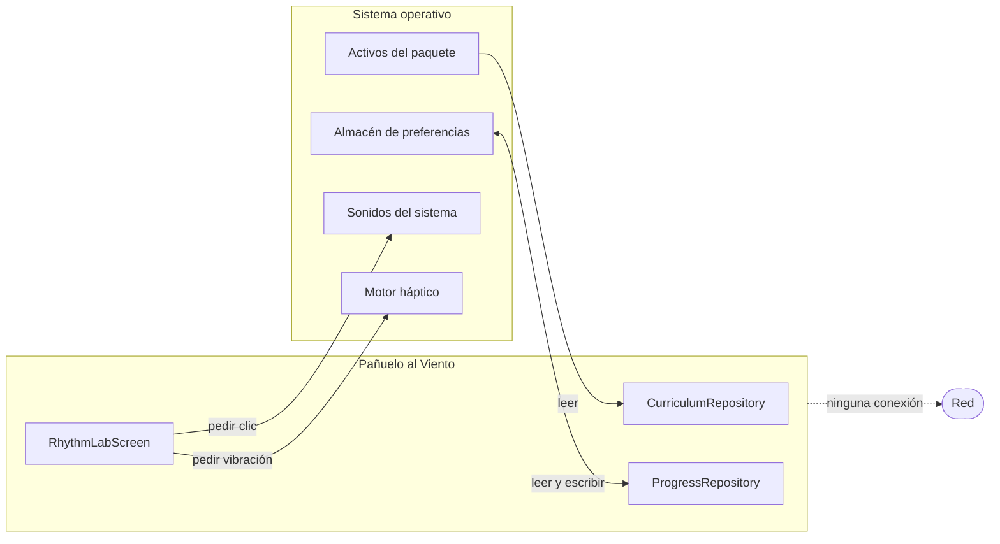

# 09 · APIs e integraciones

## No hay red. Demostración

El producto **no realiza ninguna llamada de red**. No es una afirmación de
intención: es comprobable con un comando.

```bash
$ grep -rniE "\bhttp\b|\bhttps\b|HttpClient|WebSocket|\bSocket\b|package:http|package:dio|Uri\.parse|InternetAddress" lib/
$ echo $?
1
```

Código de salida 1 significa «ninguna coincidencia». No hay cliente HTTP, no hay
sockets, no hay URL construidas en el código de producto.

Dos comprobaciones complementarias:

```bash
$ grep -rn "dart:io" lib/          # sin resultados
$ grep -c "^  [a-z_]*:$" pubspec.lock
52                                  # ningún paquete de red entre ellos
```

La única dependencia de ejecución declarada es `shared_preferences: ^2.5.3`.

> **Nota sobre falsos positivos.** Un `grep` de `dio` sin límites de palabra
> coincide con la palabra «au**dio**» en un texto de la interfaz. Por eso el
> comando de arriba usa `\b`. Vale la pena decirlo: una comprobación que se
> presenta como prueba tiene que ser reproducible tal cual está escrita.

### Y no solo en el código: en el binario

La prueba más fuerte no está en el repositorio sino en el paquete compilado.
`tool/verify_apk.mjs` incluye `android.permission.INTERNET` entre los permisos
prohibidos y **falla la release** si aparece. Es la única comprobación que ve el
manifiesto **fusionado**, es decir, los permisos que una dependencia podría
añadir sin que aparezcan en el código del proyecto.

Según [`../VALIDATION_RESULT.md`](../VALIDATION_RESULT.md), sobre el APK
publicado de 0.1.0 el resultado fue «sin permisos del sistema declarados». Esa
medición no se reprodujo en este análisis por falta de las build-tools de
Android; se cita como afirmación del repositorio.

`../PERMISSIONS.md` sigue siendo la fuente autorizada de la matriz completa de
permisos y activaciones.

## Lo que sí existe: interfaces de plataforma

No hay red, pero sí hay cuatro puntos donde la aplicación habla con el sistema
operativo. Son las integraciones reales del producto.

| Interfaz | Símbolo | Dónde | Dirección | Qué obtiene o pide |
|---|---|---|---|---|
| Activos empaquetados | `rootBundle.loadString` | `curriculum_repository.dart:21` | Lectura | Los 43 165 bytes del currículo |
| Preferencias del sistema | `SharedPreferences` | `progress_repository.dart` | Lectura y escritura | Hasta 24 identificadores |
| Sonido del sistema | `SystemSound.play(SystemSoundType.click)` | `rhythm_lab_screen.dart:350` | Salida | Un clic breve |
| Retroalimentación háptica | `HapticFeedback.mediumImpact()` | `rhythm_lab_screen.dart:353` | Salida | Una vibración corta |

Las dos últimas son **salidas, no sensores**. No leen el entorno, no identifican
a nadie y no conservan nada. El sistema operativo puede ignorarlas: en Windows
la háptica normalmente no existe, y esa ausencia no se trata como error.

Ninguna de las cuatro requiere un permiso que el usuario deba conceder.



El diagrama muestra las cuatro únicas superficies de contacto con el exterior y
marca la red como ausente. Lo que no muestra: las dos flechas de salida
(`AUDIO`, `HAPTIC`) pueden no producir efecto y la aplicación no lo comprueba ni
lo necesita.

## Contratos de datos

Al no haber API, los contratos que hay que respetar son de formato de archivo.

### Contrato 1 · `curriculum.json`

Consumido por cuatro consumidores independientes que **deben mantenerse de
acuerdo**:

| Consumidor | Lenguaje | Qué exige |
|---|---|---|
| `lib/domain/curriculum.dart` | Dart | Tipos exactos en 12 campos de clase, 6 de nivel y 4 de actividad |
| `tool/validate_curriculum.mjs` | Node | Cardinalidades, unicidad, órdenes y 8 campos no vacíos |
| `tool/validate_curriculum.dart` | Dart | Lo mismo, duplicado |
| `tool/verify_apk.mjs` | Node | Solo `levels[].lessons[]` para contar, y el hash completo |

Añadir un campo obligatorio obliga a tocar los cuatro más el JSON de las 24
clases. Es el cambio con mayor radio del repositorio. El diccionario completo
está en [07 · Persistencia](07-database.md).

### Contrato 2 · `pubspec.yaml` → todo lo demás

`tool/app_version.mjs` exige literalmente una línea:

```yaml
version: 0.1.0+1
```

y la expresión regular es `/^version:\s*(\d+\.\d+\.\d+)\+(\d+)\s*$/m`. Un
sufijo de precompilación como `0.2.0-beta+3` **no coincide** y haría fallar el
validador, la landing y la release. `NO DOCUMENTADO EN EL REPOSITORIO`: la
restricción existe en el código pero ningún documento la enuncia.

Consumidores: `validate_repository.mjs`, `verify_apk.mjs`, `build_site.mjs` y el
job `version` de `release.yml`.

### Contrato 3 · `__APP_VERSION__` en la landing

`site/index.html` debe contener el marcador `__APP_VERSION__` y **no debe**
contener ningún nombre de artefacto con versión escrita a mano.
`validate_repository.mjs` comprueba ambas cosas y falla si alguna se incumple:

```javascript
if (!site.includes('__APP_VERSION__')) { … }
const hardcoded = [...site.matchAll(/PanueloAlViento-(\d+\.\d+\.\d+)-/g)];
```

Motivo declarado en el código: «una descarga con el número congelado devuelve 404
tras publicar, y nadie se entera hasta que alguien la intenta».

### Contrato 4 · Nombres de los artefactos

Cuatro nombres exactos, con la versión dentro, comprobados en tres sitios
distintos:

```text
PanueloAlViento-<versión>-Android.apk
PanueloAlViento-<versión>-Windows-Setup.exe
PanueloAlViento-<versión>-Windows.msi
PanueloAlViento-<versión>-Windows-portable.zip
```

| Dónde se comprueba | Cómo |
|---|---|
| `validate_repository.mjs` | Que el README los nombre con la versión actual |
| `release.yml`, job `windows` | Que existan exactamente esos tres y **ningún otro** en `release-artifacts` |
| `release.yml`, job `publish` | Que los cuatro estén presentes y que no haya archivos con otra versión |

La comprobación de «ningún otro» del job `windows` es la que explica el commit
«Separa símbolos de los artefactos Windows»: el archivo `.wixpdb` que genera WiX
se dirige a `build/wix/` precisamente para que no aparezca en la carpeta de
artefactos y haga fallar el paso.

## Servicios externos del repositorio

El **producto** no habla con nadie. El **repositorio** sí depende de servicios,
y conviene tenerlos inventariados:

| Servicio | Uso | Dónde | Si desaparece |
|---|---|---|---|
| GitHub Actions | CI, release y publicación de la landing | `.github/workflows/` | No hay verificación automática ni artefactos |
| GitHub Releases | Distribución de los cuatro archivos | `release.yml`, job `publish` | No hay canal oficial de descarga |
| GitHub Pages | Landing pública | `pages.yml` | La landing deja de estar accesible |
| `pub.dev` | 52 paquetes resueltos | `pubspec.lock` | No se puede resolver desde cero; `pubspec.lock` fija las versiones pero no las almacena |
| `subosito/flutter-action@v2` | Instalar Flutter en CI | Los dos workflows que compilan | Los jobs de calidad y compilación fallan |
| `softprops/action-gh-release@v2` | Crear la release | `release.yml` | Habría que publicar a mano |
| Chocolatey | Inno Setup y WiX en el runner | `release.yml`, job `windows` | No se generan EXE ni MSI |
| `img.shields.io` | Insignias del README | `README.md` | Solo cosmético |

Las acciones de terceros se fijan **por etiqueta mayor** (`@v4`, `@v2`), no por
SHA. Registrado en [11 · Seguridad](11-security.md) como observación, no como
fallo: es la práctica habitual y el propio `SECURITY.md` declara que los
workflows usan permisos mínimos.

## Continuar por

- [10 · Configuración](10-configuration.md) para los valores y secrets.
- [11 · Seguridad](11-security.md) para la superficie de ataque.
- [`../PERMISSIONS.md`](../PERMISSIONS.md) para la matriz completa de permisos.
