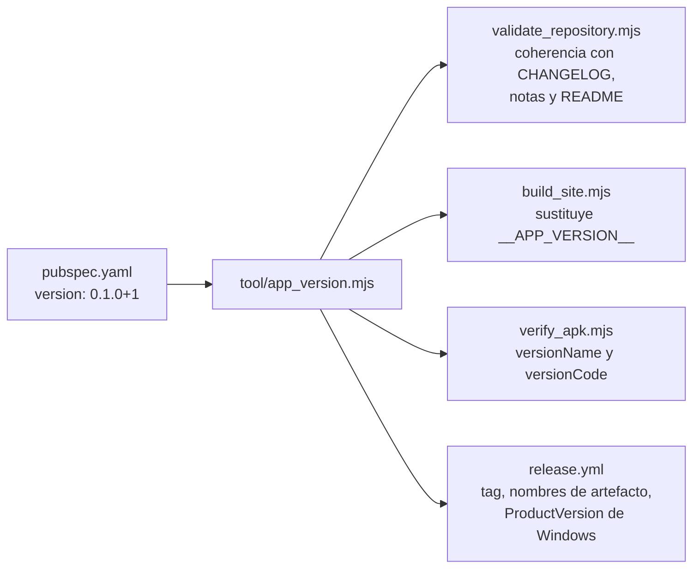

# 10 · Configuración

No hay archivos `.env`, ni `config.json`, ni parámetros en tiempo de ejecución.
Toda la configuración es de **compilación y de repositorio**, y vive en siete
archivos.

## Los siete archivos

| Archivo | Gobierna | Consumido por |
|---|---|---|
| `pubspec.yaml` | Identidad, versión, SDK, dependencias, activos e iconos | Flutter y las cuatro herramientas que leen la versión |
| `pubspec.lock` | Versiones exactas de los 52 paquetes | `flutter pub get` |
| `analysis_options.yaml` | Reglas de análisis estático | `flutter analyze` |
| `.gitignore` | Qué no se versiona | Git |
| `.gitattributes` | Finales de línea y archivos binarios | Git |
| `.editorconfig` | Formato en el editor | Editores compatibles |
| `.github/workflows/*.yml` | Automatización | GitHub Actions |

## `pubspec.yaml`

```yaml
name: panuelo_al_viento
publish_to: "none"
version: 0.1.0+1

environment:
  sdk: ">=3.7.0 <4.0.0"
  flutter: ">=3.29.0"
```

| Clave | Valor | Por qué importa |
|---|---|---|
| `name` | `panuelo_al_viento` | Determina el nombre del ejecutable Windows y el prefijo `package:panuelo_al_viento/` de los imports en las pruebas |
| `publish_to` | `"none"` | Impide publicar en `pub.dev` por accidente |
| `version` | `0.1.0+1` | **Única fuente de verdad.** Formato obligatorio `X.Y.Z+N` |
| `environment.sdk` | `>=3.7.0 <4.0.0` | Mínimo declarado; CI usa Dart 3.12.2 |
| `environment.flutter` | `>=3.29.0` | Mínimo declarado; CI fija 3.44.6 |

### La versión, en detalle

El único punto donde el número existe. `tool/app_version.mjs` lo extrae con:

```javascript
source.match(/^version:\s*(\d+\.\d+\.\d+)\+(\d+)\s*$/m)
```

y lanza un error explícito si no coincide. **Consecuencia no documentada en el
repositorio:** un sufijo de precompilación (`0.2.0-beta+3`) no coincide con esa
expresión y rompería el validador, la landing y la release.

Quien consume esa versión:



El diagrama muestra el árbol de consumo de un único valor. Lo que no muestra: el
`+N` (número de compilación) solo lo usan `verify_apk.mjs` —como `versionCode`
esperado— y el propio Android; la landing y los nombres de archivo usan
únicamente `X.Y.Z`.

### Activos

```yaml
assets:
  - assets/content/curriculum.json
  - assets/branding/
```

El primero es un archivo concreto; el segundo, un **directorio completo**.
Cualquier archivo que se añada a `assets/branding/` entrará en el binario aunque
nadie lo use.

### Iconos

`flutter_launcher_icons` genera los iconos desde `assets/branding/app-icon.png`.
`min_sdk_android: 24` y `adaptive_icon_background: "#F7EFE3"` —el crema de
`AppColors.cream`—. `ios: false`: la plataforma no está soportada.

## `analysis_options.yaml`

```yaml
include: package:flutter_lints/flutter.yaml
linter:
  rules:
    avoid_print: true
    prefer_final_locals: true
    use_build_context_synchronously: true
```

Tres reglas añadidas sobre el conjunto de `flutter_lints`. La tercera es la que
tiene consecuencias reales: obliga a comprobar `mounted` antes de usar un
`BuildContext` después de un `await`, que es exactamente el patrón de
`LessonScreen._complete()`.

`avoid_print` no afecta a `tool/*.mjs` —son JavaScript, no los ve el analizador—
ni a `tool/validate_curriculum.dart`, que usa `stdout.writeln` y `stderr.writeln`
en lugar de `print`. `INFERENCIA`: esa elección probablemente sea para cumplir la
regla, aunque el archivo no lo dice.

Estado verificado: `flutter analyze` → `No issues found!`.

## `.gitattributes`

```text
* text=auto eol=lf
*.ps1 text eol=crlf
*.png binary
*.jpg binary
*.jpeg binary
*.ogg binary
*.mp3 binary
*.mp4 binary
```

**LF en todo el repositorio**, salvo PowerShell, que lleva CRLF. Respetarlo no
es opcional: `tool/verify_apk.mjs` compara el SHA-256 del currículo del APK con
el del repositorio, y un CRLF de más cambiaría el hash y haría fallar la release.

Cualquier herramienta que escriba archivos aquí debe forzar LF explícitamente.
Las extensiones de audio y video declaradas como binarias no tienen archivos
todavía: son previsión para los medios de la versión 0.3 descrita en el
[`../../ROADMAP.md`](../../ROADMAP.md).

Este documento añade una línea a `.gitattributes` para los PDF generados, por el
mismo motivo: una normalización de finales de línea corrompería un PDF.

## `.gitignore`

Cuatro grupos, y el segundo es el que sorprende:

| Grupo | Entradas | Nota |
|---|---|---|
| Flutter y Dart | `.dart_tool/`, `build/`, `coverage/`, `.packages`, `.pub-cache/`, `.flutter-plugins*` | Estándar |
| **Plataformas generadas** | `/android/`, `/windows/`, `/release-artifacts/` | Se regeneran con `tool/bootstrap.*` o en CI |
| Editores y sistema | `.idea/`, `.vscode/`, `*.iml`, `.DS_Store`, `Thumbs.db` | Estándar |
| **Firma y secretos** | `*.jks`, `*.keystore`, `key.properties`, `.env` | Impide confirmar material de firma |
| Documento local | `MASTER_PROMPT.md` | «Documento de trabajo local; no forma parte del producto publicado» |

El grupo de firma es un control de seguridad real, no higiene: `key.properties`
contiene contraseñas del almacén de claves y `release.yml` lo crea dentro del
runner.

## Variables de entorno

Ninguna la necesita el producto. Todas son de herramientas:

| Variable | Lee | Por defecto | Para qué |
|---|---|---|---|
| `AAPT2` | `verify_apk.mjs` | Búsqueda automática | Ruta directa al binario `aapt2` |
| `ANDROID_SDK_ROOT` | `verify_apk.mjs`, `release.yml` | — | Localizar las build-tools |
| `ANDROID_HOME` | `verify_apk.mjs` | — | Alternativa a la anterior |
| `LOCALAPPDATA` | `verify_apk.mjs`, `capture_screenshots.mjs` | — | Rutas por defecto en Windows |
| `SITE_OUT` | `build_site.mjs` | `build/site` | Directorio de salida de la landing |
| `SITE_PORT` | `build_site.mjs` | `8080` | Puerto de `--serve` |
| `SHOT_PORT` | `capture_screenshots.mjs` | `8731` | Puerto del servidor de capturas |
| `SHOT_DEBUG_PORT` | `capture_screenshots.mjs` | `9333` | Puerto del protocolo DevTools |
| `CHROME_BIN` | `capture_screenshots.mjs` | Rutas habituales | Ejecutable de Chrome |
| `RUNNER_TEMP` | `release.yml` | Lo pone GitHub | Directorio del almacén de claves efímero |

`verify_apk.mjs` busca `aapt2` recorriendo `build-tools` y ordenando las
versiones con `localeCompare` numérico para tomar la más reciente.

## Secrets de GitHub

Cuatro, todos opcionales, todos para la firma de Android:

| Secret | Contenido | Si falta |
|---|---|---|
| `ANDROID_KEYSTORE_BASE64` | Archivo JKS en base64 | Se genera una clave **efímera** con `keytool` y se emite un `::warning::` |
| `ANDROID_KEY_ALIAS` | Alias de la clave | ídem |
| `ANDROID_KEY_PASSWORD` | Contraseña de la clave | ídem |
| `ANDROID_STORE_PASSWORD` | Contraseña del almacén | ídem |

**Estado en 0.1.0: no configurados.**
[`../VALIDATION_RESULT.md`](../VALIDATION_RESULT.md) lo confirma midiendo la
firma del APK publicado. La consecuencia —una actualización obligará a
desinstalar y borrará el avance local— está declarada en el README, en la
landing, en las notas de la versión, en `SECURITY.md` y en el
[`../../ROADMAP.md`](../../ROADMAP.md), que la pone como prioridad inmediata.

La rama de respaldo de `release.yml` contiene un alias y una contraseña
**literales** para ese almacén efímero. No son un secreto real —la clave se crea
y se descarta en el runner—, pero son credenciales escritas en un repositorio
público y se registran como observación en
[15 · Riesgos](15-risks-and-technical-debt.md). Sus valores no se reproducen
aquí.

[`../BUILD_MOBILE.md`](../BUILD_MOBILE.md) es la fuente autorizada del
procedimiento para crear y proteger una clave permanente.

## Valores fijados en el código

Constantes que no salen de ningún archivo de configuración y que hay que buscar
para cambiar:

| Valor | Dónde | Comentario |
|---|---|---|
| `cl.panueloalviento.panuelo_al_viento` | `verify_apk.mjs`, `bootstrap.*`, `release.yml` | Identificador del paquete Android |
| `24` (nivel de API mínimo) | `verify_apk.mjs`, `configure_platforms.mjs`, `pubspec.yaml` | Android 7.0 |
| `840` | `home_shell.dart` | Umbral entre barra inferior y lateral |
| `60`–`120`, 12 divisiones | `rhythm_lab_screen.dart` | Rango del deslizador; el inicial 84 no cae en división |
| `6` | `rhythm_lab_screen.dart` | Pulsos por ciclo |
| `completed_lessons_v1` | `progress_repository.dart` | Clave del almacén |
| `4.5` y `1.12` | `theme_contrast_test.dart` | Umbrales WCAG |
| `8`, `24`, `3`, `10`–`15` | Ambos validadores y la prueba de integridad | Cardinalidades del currículo |
| `'Explorar las 24 clases'` | `home_tab.dart` | Cifra escrita a mano, existiendo `state.totalCount` |
| `'Se desmarcarán las 24 clases…'` | `progress_tab.dart` | Ídem |
| `7C81FC5C-…-78019866B239` | `installer.iss` y `product.wxs` | Identidad del producto Windows |
| `3.44.6` | `ci.yml` y `release.yml` | Versión de Flutter, repetida en dos archivos |

Las dos cifras escritas a mano en la interfaz y la versión de Flutter repetida
están registradas en [15 · Riesgos](15-risks-and-technical-debt.md).

## Continuar por

- [11 · Seguridad](11-security.md) para el tratamiento de secretos.
- [13 · Despliegue y operación](13-deployment-and-operations.md) para el uso de
  estos valores en CI.
