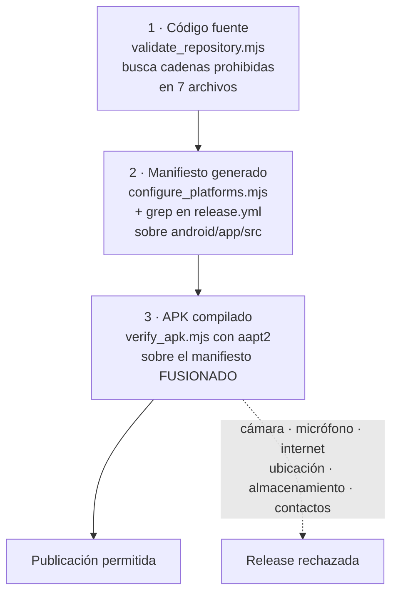

# 11 · Seguridad

[`../../SECURITY.md`](../../SECURITY.md) es la fuente autorizada para **reportar**
una vulnerabilidad y describe la superficie de 0.1.0 en términos de producto.
[`../PRIVACY.md`](../PRIVACY.md) y [`../PERMISSIONS.md`](../PERMISSIONS.md)
gobiernan el tratamiento de datos infantiles y de permisos.

Este documento aporta lo que no está cubierto: el análisis técnico de la
superficie, el inventario de controles **presentes y ausentes**, y los hallazgos
descritos sin cadena explotable.

> Este análisis fue **estático**. No se ejecutaron pruebas destructivas, no se
> atacó ningún sistema y no se instaló el producto en un dispositivo.

## Superficie de ataque, delimitada

Lo que hace que este producto tenga poca superficie no es un control: es lo que
no tiene.

| Vector habitual | Estado aquí | Evidencia |
|---|---|---|
| Servidor o API propia | **No existe** | `grep` de APIs de red sin coincidencias — ver [09](09-apis-and-integrations.md) |
| Autenticación y sesiones | **No existe** | No hay cuentas ni identidad |
| Base de datos | **No existe** | Ningún motor entre los 52 paquetes — ver [07](07-database.md) |
| Inyección SQL | **Imposible** | No hay SQL |
| Entrada de texto de la persona usuaria | **No existe** | Todos los controles son casillas, deslizadores y botones |
| Deserialización de datos externos | **Limitada** | Solo el JSON propio, empaquetado y de solo lectura |
| Carga de archivos | **No existe** | No hay importación |
| Contenido de terceros | **No existe** | Sin música, video ni web incrustada |
| Actualización automática | **No existe** | La instalación es manual |
| Permisos sensibles | **Ausentes** | Verificado sobre el APK publicado por `verify_apk.mjs` |

Lo que queda es un binario local que lee un activo propio y escribe hasta 24
cadenas en las preferencias del sistema. Los riesgos reales, como enumera
`SECURITY.md`, son **manipulación de artefactos, dependencias, persistencia
local y cambios futuros de permisos**.

## Controles presentes

### En el código

| Control | Dónde | Qué impide |
|---|---|---|
| Validación de identificador antes de persistir | `AppState.completeLesson` | Que una errata de contenido contamine el almacén |
| Escritura confirmada antes de publicar | `AppState` + `ProgressRepository` | Estado visible que el disco no respalda |
| Conjunto de avance inmutable hacia fuera | `Set.unmodifiable` en `completedLessonIds` | Mutación del avance sin pasar por la persistencia |
| Filtrado de identificadores huérfanos | `AppState.load` | Porcentaje inflado por clases retiradas |
| Confirmación antes de borrar | `ProgressTab._confirmReset` | Pérdida accidental e irreversible |
| Captura del arranque | `main` | Pantalla en blanco ante un activo corrompido |
| Modelos inmutables | `lib/domain` | Estado compartido mutable |
| `use_build_context_synchronously` | `analysis_options.yaml` | Uso de un contexto ya desmontado tras un `await` |

### En la cadena de publicación

Tres controles independientes sobre permisos, en tres momentos distintos, porque
cada uno puede fallar sin que el anterior se entere:



El diagrama muestra la defensa en profundidad sobre permisos. Lo que no muestra,
y es la razón de que el tercero exista: **solo el control 3 ve el manifiesto
fusionado**, es decir, los permisos que una dependencia podría añadir sin
aparecer nunca en el código del proyecto. Los controles 1 y 2 son ciegos a eso.

| Control | Herramienta | Alcance |
|---|---|---|
| Cadenas prohibidas | `validate_repository.mjs` | `permission_handler`, dos claves de sensor y `dart:io`, en 7 archivos concretos |
| Manifiesto fuente | `configure_platforms.mjs` | Lanza excepción si encuentra `CAMERA` o `RECORD_AUDIO` |
| Manifiesto fuente, otra vez | `release.yml` | `grep -R` sobre `android/app/src` |
| Manifiesto fusionado | `verify_apk.mjs` | Siete permisos prohibidos, incluido `INTERNET` |
| Firma | `release.yml` | `apksigner verify --verbose` |
| Integridad del contenido | `verify_apk.mjs` | SHA-256 del currículo empaquetado contra el del repositorio |
| Integridad de la descarga | `release.yml` | `SHA256SUMS.txt` con los cuatro artefactos |

### En el repositorio

| Control | Detalle |
|---|---|
| `.gitignore` de material de firma | `*.jks`, `*.keystore`, `key.properties`, `.env` |
| Permisos mínimos por workflow | `ci.yml`: `contents: read`. `pages.yml`: `contents: read`, `pages: write`, `id-token: write`. `release.yml`: `contents: write` |
| `concurrency` en release | `cancel-in-progress: false`: una publicación no se aborta a medias |
| `pubspec.lock` versionado | Las 52 versiones resueltas son las mismas en toda compilación |
| Una sola dependencia de ejecución | Superficie de suministro mínima |
| Coherencia documental automatizada | `validate_repository.mjs` impide que el README prometa lo que el manifiesto no declara |

## Controles ausentes

Enumerar solo lo presente daría una imagen falsa.

| Control ausente | Impacto | Comentario |
|---|---|---|
| Firma Android permanente | **Alto y ya materializado** | El APK 0.1.0 usa clave efímera. La primera actualización obligará a desinstalar y borrará el avance local |
| Firma Authenticode de Windows | Medio | SmartScreen advertirá. Declarado en README y `BUILD_WINDOWS.md` |
| Acciones de terceros fijadas por SHA | Bajo–medio | Se usan `@v4` y `@v2`, etiquetas móviles. Un compromiso del repositorio de la acción se propagaría |
| Escaneo automático de dependencias | Bajo | Sin Dependabot ni auditoría de vulnerabilidades en CI. La superficie es de 52 paquetes |
| Escaneo automático de secretos | Bajo | Ninguna comprobación impide confirmar un secreto nuevo |
| Cifrado del avance local | **Ninguno, y es correcto** | Los datos son identificadores como `lesson-01`. Cifrarlos añadiría gestión de claves sin proteger nada |
| Esquema JSON formal | Bajo | El currículo es propio y empaquetado; el riesgo es de corrección, no de seguridad |
| Comprobación de integridad en ejecución | Bajo | La aplicación no verifica su propio activo al arrancar. Un activo alterado tras la instalación implica que ya se comprometió el dispositivo |

## Hallazgos

Descritos sin cadena explotable y sin reproducir ningún valor.

### H-1 · Credenciales literales en el workflow de release · Media

`.github/workflows/release.yml`, en la rama que se ejecuta cuando los secrets de
firma **no** están configurados, contiene un alias y dos contraseñas escritas
literalmente. Se usan para crear con `keytool` un almacén de claves que vive
solo en el runner y se descarta al terminar el job.

- **No es la filtración de un secreto real.** La clave no existía antes ni
  persiste después.
- **Sí es material con forma de credencial en un repositorio público**, que
  puede disparar escáneres de secretos y, sobre todo, señala el estado que hay
  que resolver: mientras esa rama se ejecute, cada release produce un APK
  firmado con una clave distinta e irrepetible.
- El propio workflow emite un `::warning::` al usarla, y la limitación está
  declarada en cinco documentos del repositorio. No hay ocultación.
- **Recomendación:** configurar los cuatro secrets. Al hacerlo, la rama de
  respaldo deja de ejecutarse y las contraseñas literales dejan de tener
  función; podrían entonces sustituirse por un valor generado al vuelo.

### H-2 · Cobertura parcial del control de cadenas prohibidas · Baja

`validate_repository.mjs` busca las cadenas prohibidas en una **lista fija de
siete archivos**:

```javascript
const sourceFiles = ['pubspec.yaml', 'lib/main.dart', 'lib/app.dart'];
const libSources = [
  'lib/screens/rhythm_lab_screen.dart',
  'lib/screens/lesson_screen.dart',
  'lib/screens/progress_tab.dart',
  'lib/data/progress_repository.dart',
];
```

`lib/` tiene 15 archivos. Un archivo nuevo, o los ocho no listados, quedan fuera
de este control. El impacto real es bajo porque los controles 2 y 3 —manifiesto
fuente y manifiesto fusionado— sí son exhaustivos y son los que bloquean la
release. Pero el primer control da una sensación de cobertura que no tiene.

**Recomendación:** recorrer `lib/` completo en lugar de una lista.

### H-3 · Acciones de terceros por etiqueta móvil · Baja

Se usan `actions/checkout@v4`, `subosito/flutter-action@v2`,
`softprops/action-gh-release@v2`, entre otras. Las etiquetas mayores se mueven.
Un compromiso del repositorio de una acción se propagaría a la siguiente
ejecución.

Es la práctica habitual y el impacto está acotado por los permisos mínimos de
cada workflow. Se registra por completitud, no como fallo.

### H-4 · Sin escaneo de dependencias · Baja

52 paquetes resueltos, ninguna comprobación automática de vulnerabilidades
conocidas. La superficie es pequeña y `pubspec.lock` está versionado —lo que
significa que las versiones **sí son auditables**, a diferencia de un repositorio
sin lock—, pero nadie las audita.

**Recomendación:** un job que ejecute la auditoría de dependencias del
ecosistema es barato y encaja en `ci.yml`.

## Barrido de secretos sobre el árbol versionado

Ejecutado durante este análisis sobre todos los archivos que Git rastrea:

```bash
$ git ls-files -z | xargs -0 grep -nEI \
    "(sk-[A-Za-z0-9]{10,}|ghp_|gho_|github_pat_|AKIA[0-9A-Z]{16}|BEGIN [A-Z ]*PRIVATE KEY|xox[baprs]-)"
# ninguna coincidencia
```

Un segundo barrido, insensible a mayúsculas, sobre patrones de contraseña y
clave de API devolvió **cuatro líneas, todas en `release.yml`**: dos que asignan
desde los secrets de GitHub —correctas— y dos de la rama de respaldo descritas
en H-1. Ningún otro archivo del repositorio contiene material con forma de
credencial.

No se encontraron datos personales, ni de niñas o niños, en el código, en la
documentación ni en las nueve capturas.

## Lo que está bien y conviene proteger

- **La defensa en profundidad sobre permisos.** Tres controles en tres momentos,
  y el tercero mira el manifiesto fusionado. Es un diseño mejor que el de la
  mayoría de las aplicaciones infantiles.
- **La verificación del artefacto, no solo del repositorio.** Abrir el APK y
  contar las clases que trae dentro detecta el fallo silencioso por excelencia.
- **La minimización de datos.** No se puede filtrar lo que no se recoge. El
  avance es tan pobre en información que cifrarlo sería teatro.
- **La honestidad documental.** El repositorio declara la clave efímera, la
  ausencia de firma Authenticode y la falta de validación humana en lugar de
  esconderlas. Es una propiedad de seguridad: quien lee sabe qué está aceptando.
- **La única dependencia de ejecución.** Cada plugin nuevo es una vía por la que
  un permiso puede entrar en el manifiesto fusionado sin aparecer en el código.

## Continuar por

- [15 · Riesgos y deuda técnica](15-risks-and-technical-debt.md) para el registro
  completo de hallazgos, incluidos los no relacionados con seguridad.
- [`../../SECURITY.md`](../../SECURITY.md) para reportar.
