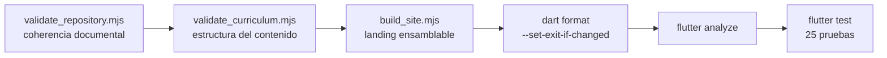

# 12 · Pruebas y calidad

[`../VALIDATION.md`](../VALIDATION.md) es la fuente autorizada de **cómo**
reproducir la verificación, y [`../VALIDATION_RESULT.md`](../VALIDATION_RESULT.md)
del resultado fechado de 0.1.0. Este documento describe qué protege cada
compuerta, cuánto cubre realmente y **qué no cubre ninguna**.

## Las compuertas del repositorio

Un verificador propio dice más sobre las prioridades de un equipo que su README.
Aquí hay seis, y su orden en CI no es casual:



El diagrama muestra el orden de `ci.yml`. Lo que no muestra, y explica el orden:
las tres primeras corren **sin instalar Flutter** —son las más baratas y las que
más rápido detectan un error de mantenimiento—, y las tres últimas necesitan el
toolchain completo. Un fallo temprano ahorra minutos de runner.

## Resultado real de la ejecución

Ejecutado durante este análisis sobre el commit `6efae74`, con Flutter 3.44.6:

```text
$ node tool/validate_repository.mjs
Repositorio válido: 32 archivos esenciales, 9 capturas y versión 0.1.0+1 coherente en pubspec, CHANGELOG, notas y README.

$ node tool/validate_curriculum.mjs
Currículo válido: 8 niveles, 24 clases y 72 actividades.

$ node tool/build_site.mjs
Landing ensamblada en …\build\site: versión 0.1.0 en 5 lugares, 9 capturas y 9 imágenes comprobadas.

$ dart format --output=none --set-exit-if-changed lib test tool
Formatted 22 files (0 changed) in 0.16 seconds.

$ flutter analyze
No issues found! (ran in 56.7s)

$ flutter test
All tests passed!    (+25)

$ dart run tool/validate_curriculum.dart
Currículo válido: 8 niveles, 24 clases y 72 actividades.
```

Las siete en verde, antes y después de documentar el código.

## Las 25 pruebas, una por una

| Archivo | Prueba | Qué protege exactamente |
|---|---|---|
| `curriculum_model_test.dart` | «convierte una clase JSON en un modelo inmutable» | Que `Lesson.fromJson` mapee los 12 campos, resuelva `ActivityType` y que los minutos sumen |
| `curriculum_integrity_test.dart` | «contiene 8 niveles, 24 clases y órdenes continuos» | Cardinalidades y `order` de 1 a 24 sin huecos |
| | «cada clase tiene tres actividades que completan su duración» | 3 actividades, suma exacta y rango 10–15 min |
| | «todos los identificadores son únicos» | Sin `id` repetidos |
| `progress_repository_test.dart` | «guarda, recupera y borra identificadores locales» | El ciclo completo sobre `SharedPreferences` simulado, incluido el ordenamiento |
| `app_state_test.dart` | «rechaza una clase inexistente sin alterar el avance» | `ArgumentError` **y** que el almacén no se toque |
| | «solo publica el avance después de guardarlo correctamente» | Que un fallo de escritura deje el avance vacío |
| | «solo borra el avance en memoria después de borrar el guardado» | Que un fallo de borrado conserve el avance anterior |
| `app_smoke_test.dart` | «abre la ruta, el ritmo y el detalle de privacidad» | Las cuatro pestañas navegables y los textos de cámara y micrófono presentes |
| `theme_contrast_test.dart` | 16 pruebas generadas | Contraste WCAG de cada par realmente dibujado, en modo claro y oscuro |

### Las tres pruebas más valiosas

Las de `app_state_test.dart`. Son las únicas que prueban una **regla de negocio
con consecuencias para la persona usuaria**, no una estructura de datos. Inyectan
un `_MemoryProgressStore` que falla a voluntad:

```dart
final store = _MemoryProgressStore(failWrites: true);
…
await expectLater(state.completeLesson('lesson-01'), throwsStateError);
expect(state.completedLessonIds, isEmpty);
```

Sin ellas, alguien podría invertir el orden de `completeLesson` —publicar antes
de confirmar— y todas las demás pruebas seguirían pasando. Toda la interfaz
`ProgressStore` existe para que estas tres puedan escribirse.

### Las 16 pruebas de contraste

No miden lo obvio. Miden **el par de colores que la interfaz dibuja de verdad**,
que no es el par que la teoría de Material sugiere. El propio archivo lo explica:

> Las tarjetas de la aplicación pintan un color de contenedor y dejan que el
> texto herede `onSurface`, que es lo que hace `Card` de Material 3 cuando se le
> pasa un `color` propio. Por eso el par que hay que medir no es
> `(primaryContainer, onPrimaryContainer)` sino el que realmente se dibuja.

Se generan en bucle: 6 superficies × 2 modos = 12, más el pulso acentuado × 2, más
la distinguibilidad de contenedores × 2 = **16**. Implementan la fórmula WCAG 2.1
de luminancia relativa a mano, sin dependencias, con umbral 4,5:1 para texto y
1,12:1 para que una tarjeta no se confunda con el fondo.

Son la razón de que exista `AppColors.redDeep`: el rojo de marca sobre blanco
solo alcanzaba 4,2:1. El CHANGELOG documenta que la suite pasó de 9 a 25 pruebas
al añadirlas.

## Cobertura: qué queda fuera

Lo importante de una suite no es lo que cubre, sino saber lo que no.

| Área | Cobertura | Consecuencia |
|---|---|---|
| `lib/domain` | Alta | Tres pruebas sobre el modelo y el currículo real |
| `lib/data` | Media-alta | Ciclo completo del progreso; el currículo se lee, pero no se prueba el fallo de lectura |
| `lib/state` | **Alta en lo que importa** | Las tres reglas transaccionales. `nextLesson` y `levelProgress` no tienen prueba dedicada |
| `lib/core` | Alta en color | 16 pruebas de contraste. La tipografía no se prueba |
| `lib/screens` | **Baja** | Un solo smoke test. Ninguna prueba del metrónomo, del cierre de clase ni del reinicio |
| `lib/widgets` | **Ninguna** | `LessonCard` y `MovementDiagram` no tienen ninguna prueba |
| `tool/` | **Ninguna** | Las 11 herramientas no tienen pruebas propias |
| Compilación real | En CI, al publicar | No en `ci.yml` |
| Dispositivo real | Ninguna | Vibración, clic y persistencia entre reinicios sin verificar |

### Los cinco huecos que más importan

**1. El metrónomo no tiene ninguna prueba.** Es el componente con más lógica
temporal del proyecto —la corrección de deriva sobre `Stopwatch`— y la única
comprobación de que funciona es abrir la aplicación y escuchar. Una prueba de
widget con reloj simulado podría verificar que el pulso *n* cae en
`n × 60/bpm` incluso tras introducir un retraso artificial. `INFERENCIA`: es el
hueco con mejor relación entre esfuerzo y valor.

**2. Ninguna prueba cubre el cambio de pestaña.** Por eso el comportamiento del
temporizador que sobrevive al `IndexedStack` no lo detectó nadie. Se verificó en
este análisis con una prueba temporal, que **no se dejó en el repositorio**
porque documentar no es corregir.

**3. `MovementDiagram` no tiene prueba.** Ninguna comprobación relaciona los
valores de `diagram` del currículo con las ramas del pintor. Una prueba de una
línea que recorra las 24 clases y afirme que cada `diagram` tiene rama propia
habría detectado que `pair` y `free` comparten dibujo.

**4. `LessonScreen` no tiene prueba.** La lógica de habilitación del botón y el
comportamiento de repetición son reglas de producto sin red.

**5. Las herramientas no se prueban a sí mismas.** `app_version.mjs` es el
símbolo del que dependen la landing, los nombres de artefacto y la release. Su
expresión regular no tiene ninguna prueba.

## Análisis estático y formato

| Compuerta | Comando | Estado |
|---|---|---|
| Formato | `dart format --output=none --set-exit-if-changed lib test tool` | 22 archivos, 0 cambiados |
| Análisis | `flutter analyze` | Sin incidencias |

`--set-exit-if-changed` es lo que convierte el formato en compuerta. El propio
`VALIDATION.md` lo explica: sin esa opción, `dart format --output=none` imprime
los archivos que cambiarían y **aun así devuelve éxito**, de modo que el paso
pasa siempre y no comprueba nada. Fue un fallo real, corregido según el
CHANGELOG.

Efecto secundario: el formateador cambia entre versiones de Dart. Por eso CI fija
Flutter 3.44.6 y `CONTRIBUTING.md` pide formatear con esa versión.

## Los validadores independientes

Su valor es que **corren sin instalar Flutter**. Cualquiera puede comprobar el
repositorio con Node y en segundos.

### `validate_curriculum.mjs`

8 niveles, 24 clases, 3 clases por nivel, identificadores únicos, órdenes 1–24
sin huecos, 3 actividades por clase, suma de minutos y 8 campos de texto no
vacíos. No comprueba que `diagram` tenga dibujo ni que `type` sea un valor del
enum.

`tool/validate_curriculum.dart` hace exactamente lo mismo en Dart. **CI no lo
ejecuta**; solo lo mencionan `CONTRIBUTING.md` y el `MASTER_PROMPT.md` no
versionado. Registrado como duplicación en
[15 · Riesgos](15-risks-and-technical-debt.md).

### `validate_repository.mjs`

El más interesante, porque no comprueba código: comprueba que **la documentación
diga la verdad**.

| Comprobación | Fallo que previene |
|---|---|
| 32 archivos esenciales presentes | Borrar un documento sin darse cuenta |
| `docs/releases/v<versión>.md` existe | Publicar sin notas |
| `CHANGELOG.md` encabeza la versión del manifiesto | Historial desincronizado |
| El README nombra los cuatro artefactos con la versión actual | README que promete descargas inexistentes |
| Las capturas que el README muestra existen | Imágenes rotas |
| Las notas de release no usan enlaces relativos | Enlaces muertos en GitHub Releases, donde no resuelven |
| `site/index.html` usa `__APP_VERSION__` y no versiones fijas | Landing que ofrece un 404 tras publicar |
| Cadenas prohibidas ausentes de 7 archivos | Introducción de dependencias de sensores |

Cada una de esas comprobaciones existe porque el fallo correspondiente es fácil
de cometer y difícil de notar. Es la compuerta con mejor relación entre líneas de
código y errores evitados de todo el repositorio.

Limitación: la comprobación de cadenas prohibidas cubre 7 de los 15 archivos de
`lib/`. Ver [11 · Seguridad](11-security.md), hallazgo H-2.

## Lo que ninguna compuerta cubre

Y ningún documento debería sugerir lo contrario:

- **Validez pedagógica.** Que las 24 clases enseñen bien. Pendiente según
  [`../TEACHER_REVIEW.md`](../TEACHER_REVIEW.md).
- **Corrección cultural.** Que la secuencia represente honestamente la cueca.
  Requiere personas cultoras.
- **Seguridad corporal real.** Que las advertencias cubran los riesgos.
- **Accesibilidad con tecnologías de apoyo.** Hay etiquetas semánticas en el
  código; una auditoría con TalkBack y el Narrador es otra cosa.
- **Comportamiento en dispositivo.** Vibración, clic y persistencia entre
  reinicios.
- **Comprensión infantil.** Que un niño de diez años entienda las instrucciones.

`VALIDATION.md` lo dice con una frase que conviene no diluir: «una suite verde
prueba consistencia técnica, no que el currículo sea cultural o corporalmente
correcto».

## Continuar por

- [13 · Despliegue y operación](13-deployment-and-operations.md) para dónde se
  ejecutan estas compuertas.
- [15 · Riesgos](15-risks-and-technical-debt.md) para los huecos registrados.
