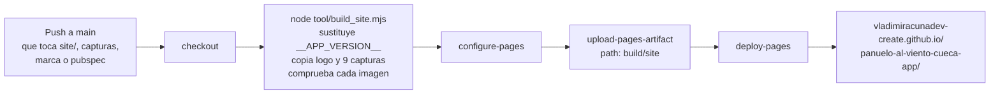
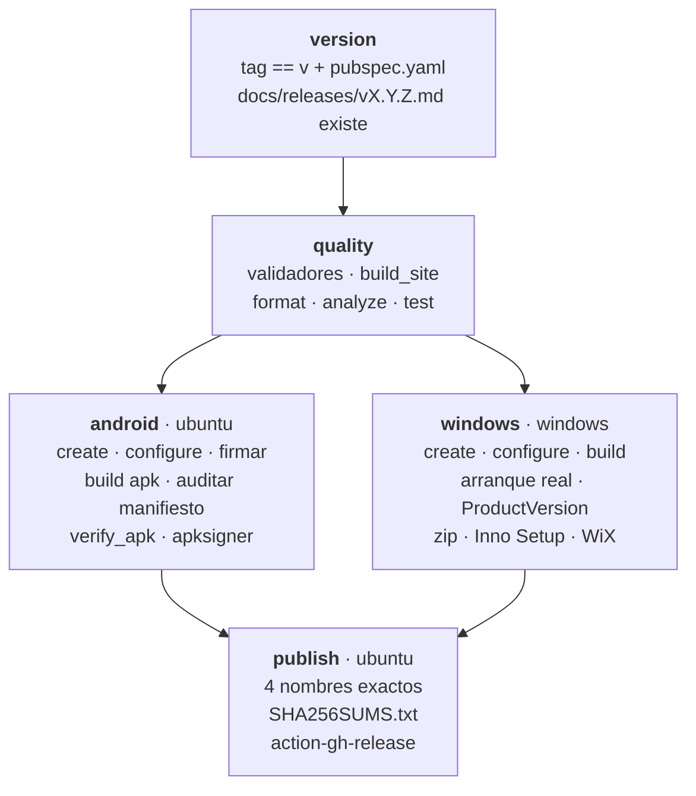

# 13 · Despliegue y operación

[`../RELEASE_CHECKLIST.md`](../RELEASE_CHECKLIST.md) es la fuente autorizada de
los **criterios** de publicación, y [`../BUILD_MOBILE.md`](../BUILD_MOBILE.md) y
[`../BUILD_WINDOWS.md`](../BUILD_WINDOWS.md) del procedimiento por plataforma.
Este documento describe la **mecánica automatizada**: qué workflow hace qué, en
qué orden, con qué compuertas, y cómo regenerar los PDF de esta carpeta.

## Los tres workflows

| Workflow | Se dispara con | Produce | Permisos |
|---|---|---|---|
| `ci.yml` | Push y PR a `main`; manual | Nada. Solo verifica | `contents: read` |
| `pages.yml` | Push a `main` que toque `site/`, `docs/screenshots/`, `assets/branding/`, `pubspec.yaml`, `tool/build_site.mjs`, `tool/app_version.mjs` o el propio workflow; manual | La landing en GitHub Pages | `contents: read`, `pages: write`, `id-token: write` |
| `release.yml` | Tag `v*`; manual con el tag como entrada | Cuatro artefactos y `SHA256SUMS.txt` en GitHub Releases | `contents: write` |

Los tres declaran permisos explícitos y mínimos. Ninguno usa el token con
permisos por defecto.

## `ci.yml` — la verificación continua

Un solo job, `quality`, en `ubuntu-latest`, con Flutter 3.44.6 fijado y caché
activada:

```yaml
- run: flutter pub get
- run: |
    node tool/validate_repository.mjs
    node tool/validate_curriculum.mjs
    node tool/build_site.mjs
- run: dart format --output=none --set-exit-if-changed lib test tool
- run: flutter analyze
- run: flutter test --reporter expanded
```

Los tres validadores de Node corren **antes** que las compuertas de Flutter, y
eso es intencionado: son las más baratas y las que más rápido detectan un error
de mantenimiento. Un fallo temprano ahorra minutos de runner.

`build_site.mjs` figura aquí no para publicar, sino porque **falla si la landing
no se puede ensamblar**: si falta una captura referenciada o si alguien escribió
un número de versión a mano en el HTML. Es una compuerta disfrazada de
compilación.

Lo que `ci.yml` **no** hace: no compila Android ni Windows. La compilación real
solo ocurre al publicar. `INFERENCIA`: un error que solo se manifieste al
compilar para una plataforma no se detecta hasta el momento del tag.

## `pages.yml` — la landing



El diagrama muestra la cadena completa. Lo que no muestra: `build_site.mjs`
**aborta con código 1** si ningún archivo de `site/` contiene `__APP_VERSION__`,
si no hay capturas, o si el HTML referencia una imagen que no llegó al
directorio de salida. La landing publicada nunca puede tener un hueco roto ni
ofrecer la descarga de una versión anterior.

`concurrency: group: pages` con `cancel-in-progress: true`: dos publicaciones
seguidas no se pisan y la última gana.

## `release.yml` — la publicación

Cinco jobs. El grafo de dependencias importa tanto como su contenido.



El diagrama muestra el orden y el paralelismo entre Android y Windows. Lo que no
muestra: **cada job rechaza en vez de avisar**. No hay pasos informativos.

### Job `version` — la compuerta más barata

```bash
APP_VERSION="$(node tool/app_version.mjs version)"
if [ "$TAG_NAME" != "v$APP_VERSION" ]; then
  echo "::error::El tag $TAG_NAME no corresponde a la versión v$APP_VERSION…"
  exit 1
fi
```

Sin instalar Flutter, en segundos, impide el fallo que el CHANGELOG documenta
haber tenido: un tag `v0.2.0` publicando archivos llamados `0.1.0` porque la
versión estaba escrita a mano en el workflow.

También exige que existan las notas `docs/releases/<tag>.md` y las pasa como
salida al job `publish`, que las usa como cuerpo de la release.

### Job `android`

| Paso | Qué comprueba o produce |
|---|---|
| `flutter create` + `configure_platforms.mjs` | Regenera `android/` con la identidad correcta y `minSdk = 24` |
| Preparar firma | Usa los secrets si existen; si no, genera una clave **efímera** con `keytool` y emite un `::warning::` |
| `flutter build apk --release` | APK universal |
| `grep -R` sobre `android/app/src` | Aborta si aparece `CAMERA` o `RECORD_AUDIO` en el manifiesto fuente |
| `node tool/verify_apk.mjs` | Paquete, `versionName`, `versionCode`, `minSdkVersion`, permisos del manifiesto **fusionado**, ABIs y currículo empaquetado |
| `apksigner verify --verbose` | Que la firma sea válida |
| `cp` con el nombre final | `PanueloAlViento-<versión>-Android.apk` |

La verificación del APK es la más valiosa de toda la cadena: extrae el currículo
del paquete, cuenta niveles y clases y compara su SHA-256 con el del
repositorio. Detecta el fallo que un build en verde no ve: un artefacto que
compila, se firma, cuadra en checksum y se instala **sin contenido**.

### Job `windows`

| Paso | Qué comprueba o produce |
|---|---|
| `flutter build windows --release` | Ejecutable, DLL y carpeta `data` |
| Prueba de arranque | Lanza el `.exe`, espera 8 s y falla si terminó con código distinto de cero |
| `ProductVersion` | Aborta si el ejecutable no declara la versión del manifiesto |
| `Compress-Archive` | El ZIP portable, con la carpeta `Release` **completa** |
| `choco install innosetup wixtoolset` | Herramientas de empaquetado |
| `ISCC.exe` | El instalador `.exe`, con la versión inyectada por `/DMyAppVersion` |
| `heat` + `candle` + `light` | El `.msi` |
| Verificar artefactos | Exige los tres nombres exactos y **rechaza cualquier archivo inesperado** |

La prueba de arranque es un detalle poco común y muy útil: comprueba que el
binario **abre**, no solo que compila.

El rechazo de archivos inesperados explica el commit «Separa símbolos de los
artefactos Windows»: el `.wixpdb` que produce WiX se dirige a `build/wix/`
precisamente para no aparecer en `release-artifacts` y hacer fallar el paso.

### Job `publish`

Descarga los artefactos de los dos jobs anteriores, comprueba que estén los
cuatro nombres exactos, que no sobre ninguno con otra versión, calcula
`sha256sum * > SHA256SUMS.txt` y publica con
`softprops/action-gh-release@v2` usando las notas de `docs/releases/`.

`fail_on_unmatched_files: true`: si un patrón no encuentra archivos, falla.

## Firma de Android: el punto abierto

| Escenario | Qué ocurre |
|---|---|
| Los cuatro secrets configurados | Firma permanente. Las actualizaciones se instalan sobre la anterior y conservan el avance |
| Alguno falta | `keytool` genera una clave efímera, se emite un `::warning::` y el APK **no se puede actualizar** |

**Estado en 0.1.0: la segunda rama.**
[`../VALIDATION_RESULT.md`](../VALIDATION_RESULT.md) lo confirma midiendo la
firma del APK publicado. La consecuencia para las personas usuarias —desinstalar
y perder el avance— está declarada en cinco documentos y en la propia landing.
El [`../../ROADMAP.md`](../../ROADMAP.md) lo pone como prioridad inmediata.

## Operación de la landing

```bash
node tool/build_site.mjs             # ensambla en build/site
node tool/build_site.mjs --serve     # además la sirve en 127.0.0.1:8080
```

Variables: `SITE_OUT` para el destino, `SITE_PORT` para el puerto. El servidor
comprueba que la ruta resuelta esté dentro del directorio de salida antes de
servir, lo que evita servir archivos de fuera.

## Regenerar las capturas

```bash
node tool/capture_screenshots.mjs
node tool/capture_screenshots.mjs --keep     # conserva el directorio temporal
```

Compila la aplicación para **web** —la única superficie que se puede renderizar
sin Visual Studio ni un dispositivo Android—, la sirve en localhost y conduce un
Chrome sin ventana por el protocolo DevTools. La interfaz, el currículo y el
estado son los mismos que en Android y Windows, así que lo que se captura es lo
que se ve allí. Requiere Flutter en el `PATH` y Chrome instalado, o `CHROME_BIN`
apuntando al ejecutable.

`CONTRIBUTING.md` pide regenerarlas cuando un cambio afecte a la interfaz.

## Regenerar los PDF de esta documentación

```bash
python tool/build_docs_pdf.py                          # los 20 + el consolidado
python tool/build_docs_pdf.py --only 03-architecture.md # iterar sobre uno
python tool/build_docs_pdf.py --no-mermaid             # degradar los diagramas
```

### Qué hace

1. Ordena los `.md` de `docs/system-documentation/`: la portada primero, después
   los numéricos.
2. Por cada documento: extrae cada bloque ` ```mermaid `, lo sustituye por un
   marcador que el conversor de Markdown no toca, y lo rasteriza con `mmdc`
   **cacheando por hash de su código fuente** en `.mermaid-cache/`. La segunda
   ejecución solo rehace lo que cambió.
3. Convierte Markdown a HTML con tablas y bloques de código.
4. Restaura los marcadores como imágenes de ancho fijo.
5. Compone portada, índice de secciones, cuerpo y pie, con hoja de estilo propia.
6. Escribe el PDF y **aborta si sale de 0 bytes**.
7. Repite concatenando todos los cuerpos para el consolidado.
8. Informa cuántos diagramas se rasterizaron y cuántos degradaron a texto.

### Requisitos

| Requisito | Si falta |
|---|---|
| `pip install markdown xhtml2pdf` | El script no arranca |
| `npm i -g @mermaid-js/mermaid-cli` | Los diagramas se incluyen como código fuente con un aviso visible, y el resumen final lo dice. **Nunca degrada en silencio** |
| Fuentes DejaVu, Arial o Segoe UI | Se usan las fuentes base de PDF y se avisa de que signos como → ≥ ● ★ podrían no dibujarse |

### Decisiones del generador que conviene conocer

- **La versión y el commit se leen del repositorio.** `pubspec.yaml` con la misma
  expresión regular que `tool/app_version.mjs`, y `git rev-parse --short HEAD`.
  Una portada con números escritos a mano queda obsoleta en el primer commit.
- **Las fuentes se registran por API de reportlab**, no con `@font-face` en el
  CSS: xhtml2pdf trata el `src` de una regla `@font-face` como recurso remoto,
  lo descarga a un temporal y reportlab falla al abrirlo.
- **Las tablas no usan `-pdf-keep-in-frame-mode: shrink`.** Esa opción encoge la
  fuente de toda la tabla hasta que quepa, y una tabla de cinco columnas acaba
  ilegible. Es preferible que el texto salte de línea dentro de la celda.
- **El índice se compone con párrafos y no con listas**, y solo indexa los `##`.
  xhtml2pdf da a cada elemento de lista una caja con separación generosa, y un
  índice de treinta entradas ocupaba más que la sección que anunciaba.
- **En Windows `mmdc` es un `.cmd`** y Node ≥ 20.12 se niega a lanzarlo sin
  shell; el script lo detecta y lo invoca a través de `cmd /c`.

`.mermaid-cache/` está en `.gitignore`. Los PDF sí se versionan, y
`.gitattributes` los declara `binary` para que ninguna normalización de finales
de línea los toque.

## Continuar por

- [12 · Pruebas y calidad](12-testing-and-quality.md) para qué protege cada
  compuerta.
- [14 · Troubleshooting](14-troubleshooting.md) si algo de esto falla.
- [`../RELEASE_CHECKLIST.md`](../RELEASE_CHECKLIST.md) para los criterios
  humanos de publicación.
